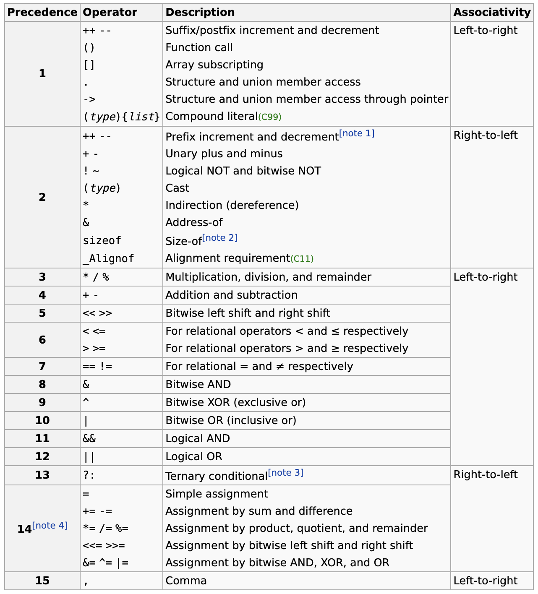

# &和+的优先级比较

记录一个bug。

## 结论



`+`的优先级比`&`的优先级高。

## example

```c
#include <stdio.h>

int main()
{
    unsigned char a = 0x01;
    unsigned char b = 0xfe;
    printf("b & b + a = %x \n", b & b + a); // 并不是先算 b & b，而是先算 b + a。
    printf("(b & b) + a = %x \n", (b & b) + a);
    return 0;
}
```

**output**
```
b & b + a = fe 
(b & b) + a = ff
```