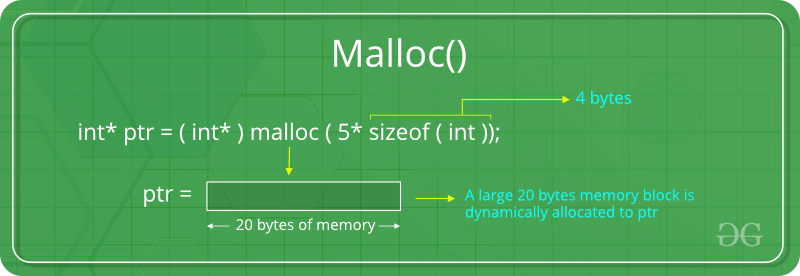
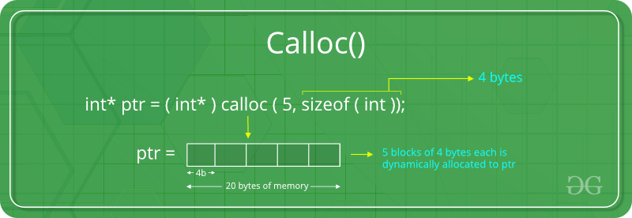
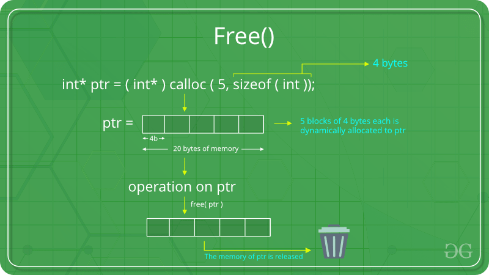
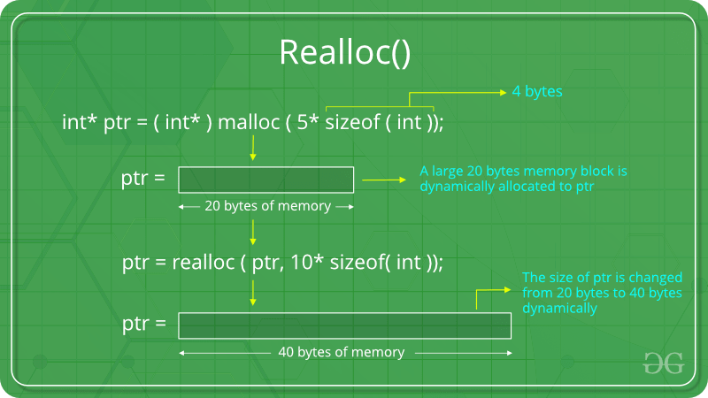

# C语言动态内存管理

## 什么是动态内存分配

内存分配 (Memory Allocation) 是指为计算机程序或服务分配物理内存空间或虚拟内存空间的一个过程。通常在程序执行前或执行时完成内存分配。

存在两种类型的内存分配：

- 编译时内存分配或静态内存分配 (Compile-time or Static Memory Allocation)：静态内存分配是由编译器为声明的变量分配内存。内存的地址可以通过地址操作符找到，并且可以赋值给指针变量。该内存是在编译时分配的。
- 运行时内存分配或动态内存分配 (Run-time or Dynamic Memory Allocation)：在程序执行时 (execution)或运行时(run-time) 进行的内存分配被称为动态内存分配。

## C语言中的动态内存管理

C语言提供一些函数来实现动态内存分配，在`<stdlib.h>`头文件中定义了以下4个用于动态内存分配的函数：

- malloc()
- calloc()
- free()
- realloc()

### malloc()

**"malloc"**，即 **"memory allocation"**，用于动态分配指定大小的单个内存块。它返回一个`void`类型的指针，该指针可以被转化为任何类型。它不会在执行时初始化内存，因此它最初使用默认的垃圾值初始化了每个块。

**malloc()的语法**

```C
ptr = (cast-type*) malloc(byte-size)

// for example
// 因为int占4个字节，所以会申请400个字节的内存，ptr指向这块内存。
ptr = (int*) malloc(100 * sizeof(int)); 
```



如果没有足够的空间，内存申请会失败，并且返回空指针。

**Example of malloc() in C**

```C
#include <stdio.h>
#include <stdlib.h>

int main()
{

	// This pointer will hold the
	// base address of the block created
	int* ptr;
	int n, i;

	// Get the number of elements for the array
	printf("Enter number of elements:");
	scanf("%d",&n);
	printf("Entered number of elements: %d\n", n);

	// Dynamically allocate memory using malloc()
	ptr = (int*)malloc(n * sizeof(int));

	// Check if the memory has been successfully
	// allocated by malloc or not
	if (ptr == NULL) {
		printf("Memory not allocated.\n");
		exit(0);
	}
	else {

		// Memory has been successfully allocated
		printf("Memory successfully allocated using malloc.\n");

		// Get the elements of the array
		for (i = 0; i < n; ++i) {
			ptr[i] = i + 1;
		}

		// Print the elements of the array
		printf("The elements of the array are: ");
		for (i = 0; i < n; ++i) {
			printf("%d, ", ptr[i]);
		}
	}

	return 0;
}
```

**Output**

```
Enter number of elements: 5
Memory successfully allocated using malloc.
The elements of the array are: 1, 2, 3, 4, 5,
```

### calloc()

**"calloc"**，即 **"contiguous allocation"**，用于动态分配指定类型和指定数量的内存块。和`malloc()`相似，但是有以下两点不同：

- `calloc()`把每一个内存块都初始化为'0'。
- `calloc()`有两个参数。

**calloc()的语法**

```C
ptr = (cast-type*)calloc(n, element-size); // n是元素的数量，element-size是元素的大小

// for example
// 申请25个连续的大小为sizeof(float)的内存块
ptr = (float*) calloc(25, sizeof(float));
```



如果空间不足，内存申请失败并返回空指针。

**Example of calloc() in C**

```C
#include <stdio.h>
#include <stdlib.h>

int main()
{

	// This pointer will hold the
	// base address of the block created
	int* ptr;
	int n, i;

	// Get the number of elements for the array
	n = 5;
	printf("Enter number of elements: %d\n", n);

	// Dynamically allocate memory using calloc()
	ptr = (int*)calloc(n, sizeof(int));

	// Check if the memory has been successfully
	// allocated by calloc or not
	if (ptr == NULL) {
		printf("Memory not allocated.\n");
		exit(0);
	}
	else {

		// Memory has been successfully allocated
		printf("Memory successfully allocated using calloc.\n");

		// Get the elements of the array
		for (i = 0; i < n; ++i) {
			ptr[i] = i + 1;
		}

		// Print the elements of the array
		printf("The elements of the array are: ");
		for (i = 0; i < n; ++i) {
			printf("%d, ", ptr[i]);
		}
	}

	return 0;
}
```

**Output**

```
Enter number of elements: 5
Memory successfully allocated using calloc.
The elements of the array are: 1, 2, 3, 4, 5,
```

### free()

**"free"** 用来动态释放已经申请的内存，`malloc()`和`calloc()`并不会释放他们申请的内存，`free()`可以减少内存浪费。

**free()的语法**

```C
free(ptr);
```



**Example of free() in C**

```C
#include <stdio.h>
#include <stdlib.h>

int main()
{

	// This pointer will hold the
	// base address of the block created
	int *ptr, *ptr1;
	int n, i;

	// Get the number of elements for the array
	n = 5;
	printf("Enter number of elements: %d\n", n);

	// Dynamically allocate memory using malloc()
	ptr = (int*)malloc(n * sizeof(int));

	// Dynamically allocate memory using calloc()
	ptr1 = (int*)calloc(n, sizeof(int));

	// Check if the memory has been successfully
	// allocated by malloc or not
	if (ptr == NULL || ptr1 == NULL) {
		printf("Memory not allocated.\n");
		exit(0);
	}
	else {

		// Memory has been successfully allocated
		printf("Memory successfully allocated using malloc.\n");

		// Free the memory
		free(ptr);
		printf("Malloc Memory successfully freed.\n");

		// Memory has been successfully allocated
		printf("\nMemory successfully allocated using calloc.\n");

		// Free the memory
		free(ptr1);
		printf("Calloc Memory successfully freed.\n");
	}

	return 0;
}
```

**Output**

```
Enter number of elements: 5
Memory successfully allocated using malloc.
Malloc Memory successfully freed.

Memory successfully allocated using calloc.
Calloc Memory successfully freed.
```

### realloc()

**"realloc"**，即 **"re-allocation"**，一般用来动态的改变先前已经分配的内存。换句话说，如果先前使用`malloc()`或`calloc()`分配的内存不够用，`realloc()`可以重新分配内存。在保持先前已经分配的内存的基础上，新添加的内存将被初始化为默认的垃圾值。

**realloc()的语法**

```C
ptr = realloc(ptr, newSize); // where ptr is reallocated with new size 'newSize'.
```



如果内存空间不足，函数运行失败，返回空指针。

**Example of realloc() in C**

```C
#include <stdio.h>
#include <stdlib.h>

int main()
{

	// This pointer will hold the
	// base address of the block created
	int* ptr;
	int n, i;

	// Get the number of elements for the array
	n = 5;
	printf("Enter number of elements: %d\n", n);

	// Dynamically allocate memory using calloc()
	ptr = (int*)calloc(n, sizeof(int));

	// Check if the memory has been successfully
	// allocated by malloc or not
	if (ptr == NULL) {
		printf("Memory not allocated.\n");
		exit(0);
	}
	else {

		// Memory has been successfully allocated
		printf("Memory successfully allocated using calloc.\n");

		// Get the elements of the array
		for (i = 0; i < n; ++i) {
			ptr[i] = i + 1;
		}

		// Print the elements of the array
		printf("The elements of the array are: ");
		for (i = 0; i < n; ++i) {
			printf("%d, ", ptr[i]);
		}

		// Get the new size for the array
		n = 10;
		printf("\n\nEnter the new size of the array: %d\n", n);

		// Dynamically re-allocate memory using realloc()
		ptr = (int*)realloc(ptr, n * sizeof(int));

		// Memory has been successfully allocated
		printf("Memory successfully re-allocated using realloc.\n");

		// Get the new elements of the array
		for (i = 5; i < n; ++i) {
			ptr[i] = i + 1;
		}

		// Print the elements of the array
		printf("The elements of the array are: ");
		for (i = 0; i < n; ++i) {
			printf("%d, ", ptr[i]);
		}

		free(ptr);
	}

	return 0;
}
```

**Output**

```
Enter number of elements: 5
Memory successfully allocated using calloc.
The elements of the array are: 1, 2, 3, 4, 5, 

Enter the new size of the array: 10
Memory successfully re-allocated using realloc.
The elements of the array are: 1, 2, 3, 4, 5, 6, 7, 8, 9, 10,
```

## 参考

[Dynamic Memory Allocation in C using malloc(), calloc(), free() and realloc() - GeeksforGeeks](https://www.geeksforgeeks.org/dynamic-memory-allocation-in-c-using-malloc-calloc-free-and-realloc/)

[Dynamic memory management - cppreference.com](https://en.cppreference.com/w/c/memory)

[What is Dynamic Memory Allocation? - GeeksforGeeks](https://www.geeksforgeeks.org/what-is-dynamic-memory-allocation/)

[详解C++的静态内存分配与动态内存分配_C 语言_脚本之家](https://www.jb51.net/program/290529hsz.htm)

[Difference between Static and Dynamic Memory Allocation in C - GeeksforGeeks](https://www.geeksforgeeks.org/difference-between-static-and-dynamic-memory-allocation-in-c/)