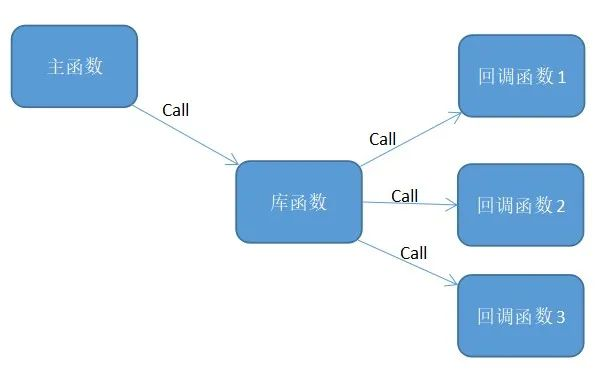

# C语言回调函数

## 什么是回调函数

> In computer programming, a callback or callback function is any reference to executable code that is passed as an argument to another piece of code; that code is expected to call back (execute) the callback function as part of its job.  -- Wikipedia

在计算机编程中，把一段可执行代码像参数那样传递给其他代码（这里的其他代码一般指的就是一个函数，传递可执行代码时一般会使用函数指针），这段可执行代码在某个时刻会被调用执行，这段可执行代码就叫做回调函数。

## 为什么使用回调函数

因为可以把调用者与被调用者分开，所以调用者不关心谁是被调用者。它只需知道存在一个具有特定原型和限制条件的被调用函数。

简而言之，就是允许用户把需要调用的方法的指针作为参数传递给一个函数，以便该函数在处理相似事件的时候可以灵活的使用不同的方法（就是传递不同的函数指针）。



## 一个回调函数的例子

在C语言中，回调函数一般是使用[函数指针](https://zhuanlan.zhihu.com/p/678613581)实现的。

```C
// A simple C program to demonstrate callback
#include <stdio.h>

void A(){ 
printf("I am function A\n");
}

// callback function
void B(void (*ptr)())
{
	(*ptr)(); // callback to A
}

int main()
{
	void (*ptr)() = &A;

	// calling function B and passing
	// address of the function A as argument
	B(ptr);

	return 0;
}
```

**Output**

```
I am function A
```

## 参考

[Callbacks in C - GeeksforGeeks](https://www.geeksforgeeks.org/callbacks-in-c/)

[Callback (computer programming) - Wikipedia](https://en.wikipedia.org/wiki/Callback_(computer_programming))

[C 语言回调函数详解 | 菜鸟教程](https://www.runoob.com/w3cnote/c-callback-function.html)

[回调函数原来这么容易理解-云社区-华为云](https://bbs.huaweicloud.com/blogs/273798)

[回调函数（callback）是什么？ - 知乎](https://www.zhihu.com/question/19801131)