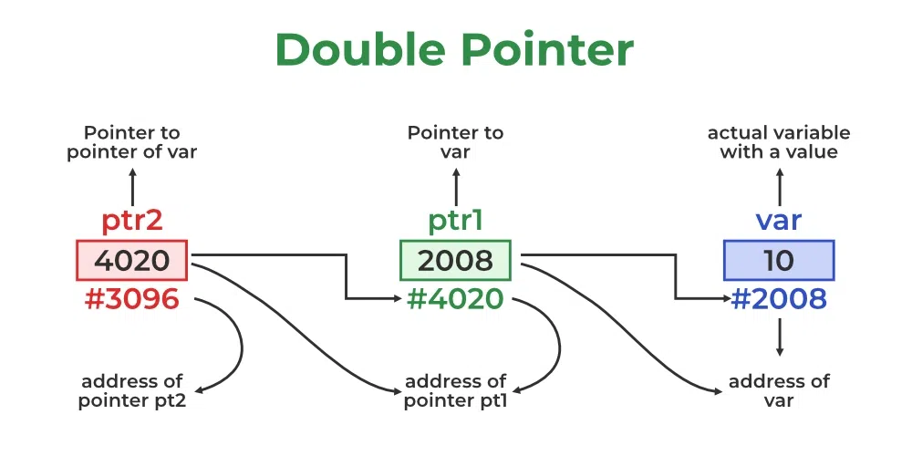
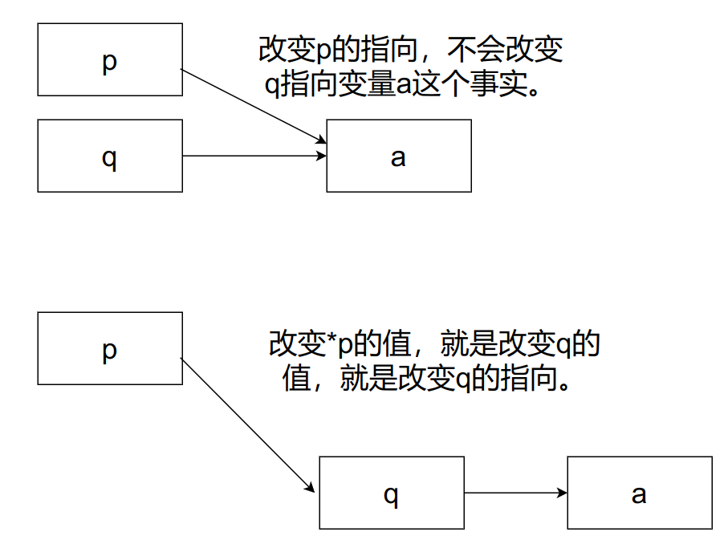

# 二级指针作为函数参数

## 什么是二级指针

二级指针，即指向指针的指针（pointer to pointer），也叫双重指针（double pointer），用来存储另一个指针的地址。

下图可以比较清晰的理解二级指针的概念：变量`var`中存储整数`10`，指针`ptr1`存储变量`var`的地址`2008`，指针`ptr2`存储指针`ptr1`的地址`4020`，指针`ptr2`就是二级指针。



## 二级指针的声明

二级指针的声明和普通指针的声明类似，只不过在指针变量前有两个`*`。

```C
data_type_of_pointer **name_of_variable = & normal_pointer_variable;
```

```C
int val = 5;
int *ptr = &val;    // storing address of val to pointer ptr.
int **d_ptr = &ptr; // pointer to a pointer declared
                    // which is pointing to an integer. 
```

**Example 1**

```C
// C program to demonstrate pointer to pointer
#include <stdio.h>

int main()
{
	int var = 789;

	// pointer for var
	int* ptr2;

	// double pointer for ptr2
	int** ptr1;

	// storing address of var in ptr2
	ptr2 = &var;

	// Storing address of ptr2 in ptr1
	ptr1 = &ptr2;

	// Displaying value of var using
	// both single and double pointers
	printf("Value of var = %d\n", var);
	printf("Value of var using single pointer = %d\n", *ptr2);
	printf("Value of var using double pointer = %d\n", **ptr1);

	return 0;
}
```

**Output**

```
Value of var = 789
Value of var using single pointer = 789
Value of var using double pointer = 789
```

## 二级指针作为函数参数

### 一级指针作为函数参数

**Example 2**

```C
#include <stdio.h>

int a = 10;
int b = 100;

void func(int *p)
{
    p = &b;
}

int main(void)
{
	int *q = &a;
    printf("before func: %d\n",*q);
    func(q);
    printf("after func: %d\n",*q);
	return 0;
}
```

**Output**

```
before func: 10
after func: 10
```

对于上面的例子，函数`func`并没有改变指针`q`所存储的地址的值，所以输出结果为`10`。如果我们想要改变指针所存储的地址的值，就需要使用二级指针。

### 二级指针作为函数参数

**Example 3**

```C
#include <stdio.h>

int a = 10;
int b = 100;

void func(int **p)
{
    *p = &b;
}

int main(void)
{
	int *q = &a;
    printf("before func: %d\n",*q);
    func(&q);
    printf("after func: %d\n",*q);
	return 0;
}
```

**Output**

```
before func: 10
after func: 100
```

对于上面的例子，函数`func`的参数是二级指针，最终输出结果为`100`，改变了指针`q`所存储的地址的值。

### 解释

**一级指针作为函数参数没有改变`*q`的值的原因**：如下面的代码所示，指针变量`q`作为参数传给函数`func`时，在函数内部生成了一个指针变量`q`的临时的副本`p`，改变这个副本`p`的值并不会改变`q`的值，所以函数`func`运行以后，`q`的值并没有发生改变，所以输出的`*q`的值和函数运行以前是一样的。

```C
#include <stdio.h>

int a = 10;
int b = 100;

void func(int *p)
{
    printf("address of p is: %p\n", &p);
    p = &b;
}

int main(void)
{
	int *q = &a;
    printf("address of q is: %p\n", &q);
    printf("before func: %d\n",*q);
    func(q);
    printf("address of q is: %p\n", &q);
    printf("after func: %d\n",*q);
	return 0;
}
```

**Output**

```
address of q is: 0x7fffffffd628
before func: 10
address of p is: 0x7fffffffd608
address of q is: 0x7fffffffd628
after func: 10
```

**二级指针作为函数参数可以改变`*q`的值的原因**：如下面代码所示，向函数`func`传递参数`&q`时，会生成一个临时的二级指针的副本`p`，`p`的值为`q`的地址，即`P`指向`q`，`*p`就是`q`（代码中输出的`*p`的地址和`p`的地址相同），所以改变`*p`的值就会改变`q`的值。

```C
#include <stdio.h>

int a = 10;
int b = 100;

void func(int **p)
{
    printf("address of *p is: %p\n", &*p);
    *p = &b;
    printf("address of *p is: %p\n", &*p);
}

int main(void)
{
	int *q = &a;
    printf("address of q is: %p\n", &q);
    printf("before func: %d\n",*q);
    func(&q);
    printf("address of q is: %p\n", &q);
    printf("after func: %d\n",*q);
	return 0;
}
```

**Output**

```
address of q is: 0x7fffffffd628
before func: 10
address of *p is: 0x7fffffffd628
address of *p is: 0x7fffffffd628
address of q is: 0x7fffffffd628
after func: 100
```

**即**：一级指针改变的是在函数内部产生的指针的副本；二级指针改变的是在函数内部产生的二级指针的副本所指向的地址，即改变了一级指针，即`q`发生了改变。



## 参考

[二级指针的作用详解 - 科技小飞哥](https://www.techxiaofei.com/post/cpp/secondary_pointer/)

[C - Pointer to Pointer (Double Pointer) - GeeksforGeeks](https://www.geeksforgeeks.org/c-pointer-to-pointer-double-pointer/)