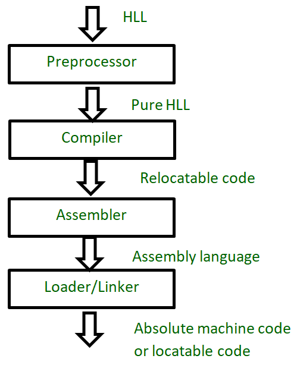
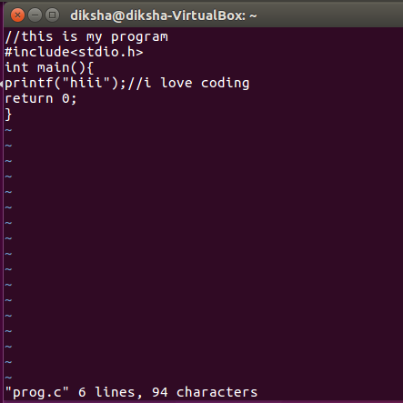
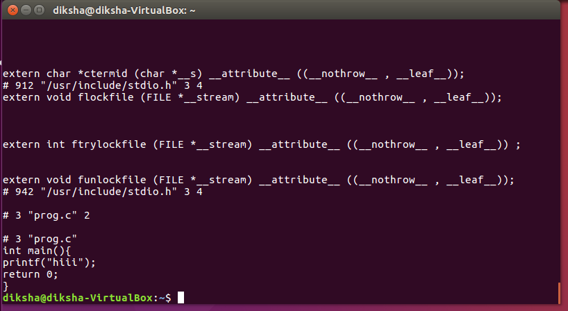

# 预处理器做了什么

## 概述

预处理器是一个系统软件，它用来对高级语言（High Level Language，HLL）进行预处理，预处理是语言处理系统的第一个步骤，语言处理系统把高级语言翻译成机器语言或者机器码。

C语言的作用域规则并不适用于预处理器。像`#define`这样的预处理器命令从被定义的位置开始到文件结束一直有效，并不受块结构的约束。



## 预处理器主要做了以下三件事

### 删除注释

预处理器会删除所有的注释。注释只是为了让人类更好的理解代码，对于计算机而言，程序的执行不需要注释，所以注释会被删除。

写一个C代码，假设文件名为`prog.c`，使用命令`gcc -E prog.c`对代码进行预处理。



预处理以后可以看到已经没有注释了。



### 文件包含

将我们程序用到的库文件包含进来，在C语言中使用`#include`命令就是这个作用，会指明需要包含哪一个文件。比如`#include <stdio.h>`就告诉预处理器需要将`stdio.h`包含进来。

### 宏展开

宏可以作为小函数调用，而不需要处理开销。如果我们必须编写一个需要递归调用的函数，那么我们应该更喜欢宏而不是函数。

有两种类型的宏：有参数的宏(function-like)和没有参数的宏(object-like)。

```C
// object-like macro
#define SI 1000       
// function-like macro          
#define FUNC(A) printf(A)  
```

可以使用命令`#undef`删除宏定义。

```C
// delete the macro
#undef SI
```

可以像函数一样，使用多行宏定义，但是每一行末尾需要有`\`。

```C
#include <stdio.h> 

#define MACRO(num, str) {\ 
			printf("%d", num);\ 
			printf(" is");\ 
			printf(" %s number", str);\ 
			printf("\n");\ 
		}
```

## 参考

[How a Preprocessor works in C? - GeeksforGeeks](https://www.geeksforgeeks.org/preprocessor-works-c/?ref=lbp)