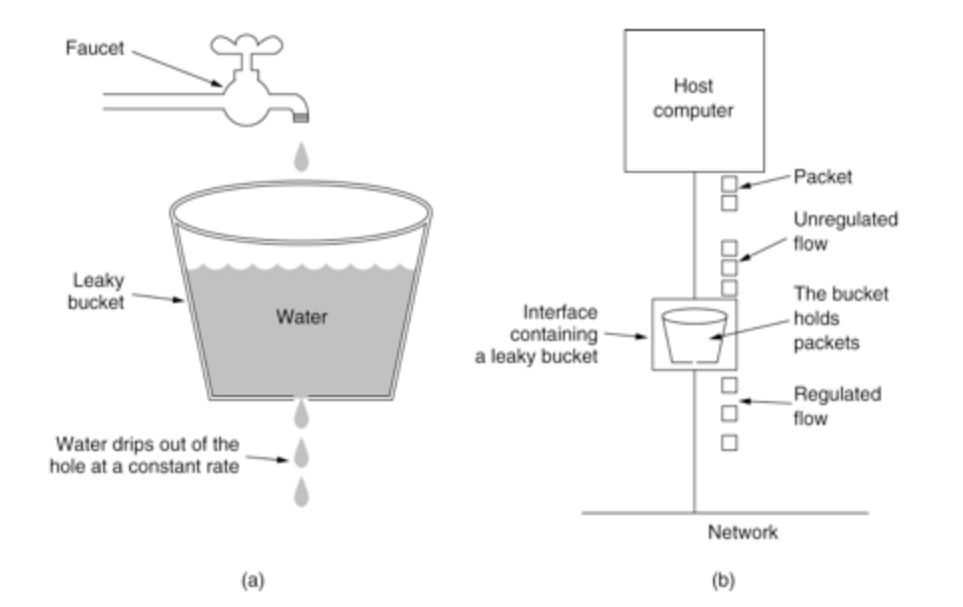
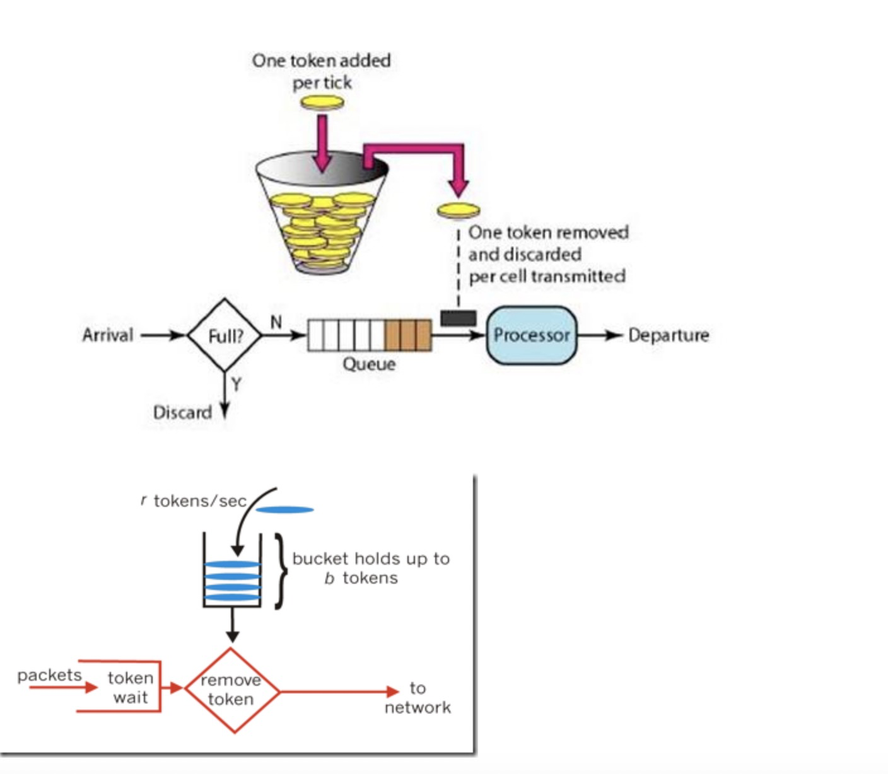

# 漏桶和令牌桶概述

令牌桶算法和漏桶算法是网络流量整形（Traffic Shaping）和速率限制（Rate Limiting）中最常使用的两种算法。

## 流量整形和速率限制

**流量整形（Traffic Shaping）**：是一种主动调整流量输出速率的措施。当下游设备的入接口速率小于上游设备的出接口速率或发生突发流量时，下游设备入接口处可能出现流量拥塞的情况，此时用户可以通过在上游设备的接口出方向配置流量整形，将上游不规整的流量进行削峰填谷，输出一条比较平整的流量，从而解决下游设备的拥塞问题。

**速率限制（Rate Limiting）**：是限制数据传输速率的措施。百度网盘非会员下载速率就是速率限制的一个典型例子。

## 漏桶（Leaky Bucket）工作原理

漏桶的工作原理是，当系统持续收到分组报文时，报文首先都被放入漏桶中，漏桶以固定的速率输出报文，如果系统收到的流量存在突发，超过漏桶深度，则直接溢出。

## 令牌桶（Token Bucket）工作原理

令牌桶的工作原理是，系统以一定的速率（CIR）往令牌桶中放入令牌，当桶中的令牌数达到令牌桶容量（CBS）时，则后续放入的令牌被丢弃。当系统持续收到报文分组时，每个报文分组需要向令牌桶请求一个或者多个（根据报文长度决定）令牌，只有获取到足够的令牌（如果该分组报文需要3个令牌，而令牌桶中只剩余2个令牌，则条件不满足，获取令牌失败），该报文才能进入QoS队列转发，此时，令牌桶中的令牌总数会随之减少。

## 异同

漏桶和令牌桶都可用于限流，但是，令牌桶还允许一定程度的**突发流量**。

## 参考

[三层交换机之令牌桶和漏桶 - 者旨於陽 - 博客园](https://www.cnblogs.com/justin-y-lin/p/15680811.html)

[流量监管和流量整形概述 - NetEngine AR V300R019 配置指南-QoS（命令行） - 华为](https://support.huawei.com/enterprise/zh/doc/EDOC1100112412/6a2ff2d6)

[Leaky bucket - Wikipedia](https://en.wikipedia.org/wiki/Leaky_bucket)

[Token bucket - Wikipedia](https://en.wikipedia.org/wiki/Token_bucket)

[限流:漏桶算法和令牌桶算法 - 茶歇驿站 - Gopher, OpenSource Fans, 成长之路有我相伴。](https://maiyang.me/post/2017-05-28-rate-limit-algorithm/)

[流量整形以及路由器漏桶、令牌桶算法 · tkorays|言剑](https://www.tkorays.com/2019/04/05/tracffic-shaping-and-bucket-algorithm/)

