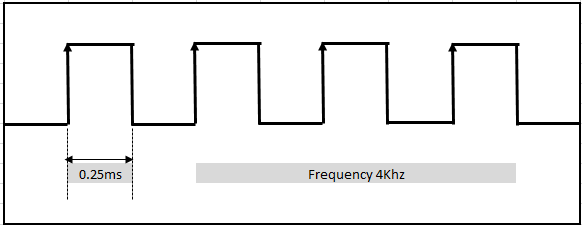

# 看门狗定时器概述

## 什么是看门狗定时器（watchdog timer）

看门狗定时器是微控制器中的一个硬件部件，当系统卡住的时候，看门狗定时器可以将系统进行重置。即如果系统进入到无限循环，看门狗定时器可以重置系统以跳出无限循环。看门狗定时器是嵌入式系统中的安全机制，可以使系统更可靠。

## 看门狗定时器是如何工作的

看门狗定时器本质上是一个计数器，它从零开始计数，一直增加到某个特定的值（假设这个值是`Max`）。如果计数器达到了这个特定的值（`Max`），看门狗定时器会重置系统。为了使系统正常运行，避免进行重置，软件需要重新启动看门狗定时器，即将计数器重置为零。如果软件进入了死循环，系统就无法重新启动看门狗定时器，计数器达到特定的值以后就会重置系统。

在系统进行初始化的时候会设定看门狗定时器可以达到的最大的值（`Max`），这个值是依据看门狗定时器的超时时间进行计算的。在超时之前，应该重置计数器。

例如，假设系统定期执行3个任务，执行这三个任务需要500毫秒，超时时间可以被设置为600毫秒，`Max`就可以根据超时时间计算得到，并且在系统初始化的时候设置这个值。如何计算在下面会说。

下图描述了看门狗定时器的硬件原理，输入的是时钟信号，根据时钟信号将内部的计数器进行递增。有一个比较器，会将计数器和最初设置的`Max`的值进行比较，如果相等，看门狗定时器就会产生重置信号，系统就会进行重置。


## 计数器的最大值`Max`如何进行计算

假设看门狗定时器的时钟频率是4kHz,系统完成工作的时间是450毫秒，我们取500毫秒作为一个超时时间，那么：

```
1/4 kHz= 0.25 ms.
1 tick of clock = 0.25 ms. 
500 ms =2000 ticks.
```

当时钟滴答作响2000次时，500毫秒就结束了，所以计数器的最大值（`Max`）为2000。如果看门狗计数器达到2000，它将产生下图所示的复位信号。在达到2000之前，系统需要将计数器重置为0。



## 看门狗定时器的实现

如下面的代码所示，假设系统有3个周期性任务，`task1`，`task2`，`task3`。完成这3个任务需要450毫秒，完成3个任务以后应该重置看门狗定时器，这样系统就不会进行系统重置。

如果系统在某一个任务上卡住了，就不会重置看门狗定时器，计数器就会一直增加，达到2000的时候，会产生一个重置信号，系统会进行重置。

```C
void main()
{
        while(1)
        {
            task1();
            task2();
            task3();
            kick_wdg(); // called before 500ms

        } //end of while

} // end of main
```

## 参考

[菜鸟晋级！一篇文章读懂看门狗定时器!](https://www.sohu.com/a/206664755_464086)

[Watchdog Timer in Embedded System](https://www.embeddedtutor.com/2019/02/watchdog-timer-in-embedded-system.html)

[Watchdog timer - Wikipedia](https://en.wikipedia.org/wiki/Watchdog_timer)