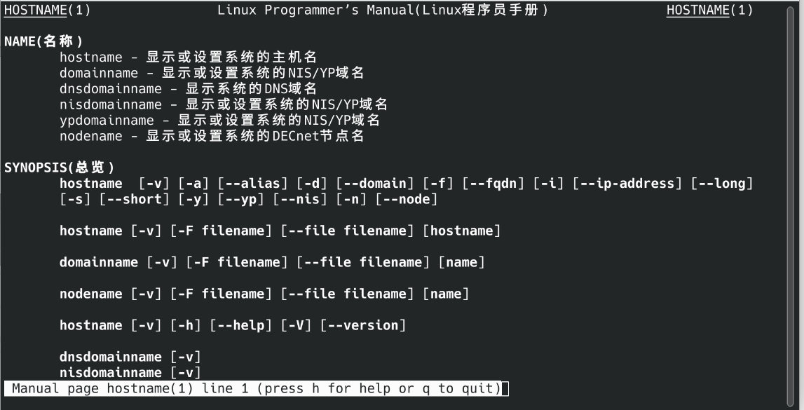

[参考 Linux命令行与shell脚本编程大全 第四版 3.3 与手册交互]()

# man

大多数 Linux 发行版自带在线手册,可用于查找 shell 命令以及其他 GNU 实用工具的相关信息。熟悉手册对于使用各种 Linux 工具大有裨益,尤其是当你想要弄清各种命令行参数的时候。

man 命令可以访问 Linux 系统的手册页。在 man 命令之后跟上想要查看的命令名,就可以显示相应的手册页。图 1 展示了如何查找 hostname 命令的手册页。输入命令 man hostname 即可进入该页面。

往下滑还有DESCRIPTION一节。这部分内容松散,字里行间充满了技术术语。bash 手册并不是按部就班的学习指南,而是作为快速参考来使用的。

    如果你刚接触 bash shell,可能会觉得手册页也没那么有用。然而,随着逐渐习惯使用手册页,尤其是阅读 DESCRIPTION 部分的前一两段,最终你会从中学到各种技术术语,手册页也会变得越来越有用。

当你使用 man 命令查看命令手册页的时候,其中的信息是由分页程序(pager)来显示的。分页程序是一种实用工具,能够逐页(或逐行)显示文本。你可以单击空格键进行翻页,或是使用 Enter 键逐行查看。也可以使用箭头键向前和向后滚动手册页的内容(假设你使用的终端仿真软件包支持箭头键功能)。

如果阅读完毕,可以按 q 键退出手册页,然后你会重新获得 shell CLI 提示符,表明 shell 正在等待接受下一个命令。

    bash 手册甚至包含了一份有关自身的参考信息。输入 man man 可以查看与手册页相关的信息。

手册页将与命令相关的信息分成了多段。每一段的惯用名标准如下表所示。

|段|描述|
|---|---|
|Name|显示命令名和一段简短的描述|
|Synopsis|命令语法|
|Configuration|命令配置信息|
|Description|命令的一般性描述|
|Options|命令选项描述|
|Exit Status|命令的退出状态|
|Return Value|命令的返回值|
|Errors|命令的错误消息|
|Environment|命令使用的环境变量|
|Files|命令用到的文件|
|Versions|命令的版本信息|
|Conforming To|遵循的命名标准|
|Notes|其他有帮助的资料|
|Bugs|提交 bug 的途径|
|Example|命令用法示例|
|Authors|命令开发人员的信息|
|Copyright|命令源代码的版权状况|
|See Also|与该命令类似的其他命令|

并不是每一个命令的手册页都包含表 3-1 中列出的所有段名。另外,有些命令使用的段名并没有在上面的惯用标准中列出。

在命令概要部分中,你可以了解如何在命令行中输入该命令。很多命令采用的基本模式如下。

` COMMAND-NAME [OPTION]... [ARGUMENT]... `

下面是对以上命令的模式结构的解释。
    * COMMAND-NAME 是要运行的命令名。
    * [OPTION]是用于修改命令行为的选项。可添加的 OPTION (也称作开关)通常不止一个。中括号([])表示 OPTION 并不是必需的,3 个点号( ...)表示可以一次指定多个 OPTION 。
    * [ARGUMENT]是传递给命令的参数,以指明命令的操作对象。从中括号可以看出, ARGUMENT也不是必需的,也可以一次指定多个 ARGUMENT。

    如果想使用多个命令选项,那么通常可以将其合并在一起。例如,要使用选项 -a 和-b,可以写作-ab。

不同命令的作者不同,用法也各异。因此,命令手册页中的概要部分是了解该命令正确语法的好地方。

    如果不记得命令名了,可以使用关键字来搜索手册页。语法为 man -k keyword。例如,要查找与终端相关的命令,可以输入 man -k terminal。

除了按照惯例命名的各段,手册页中还有不同的节。每节都分配了一个数字,从 1 开始,一直到 9,如下表所示。

|节号|所涵盖的内容|
|---|---|
|1|可执行程序或 shell 命令|
|2|系统调用|
|3|库调用|
|4|特殊文件|
|5|文件格式与约定|
|6|游戏|
|7|概览、约定及杂项|
|8|超级用户和系统管理员命令|
|9|内核例程(routine)|

man 命令通常显示的是指定命令编号最低的节。例如,我们在图 3-1 中输入的是 man host-name,注意在显示内容的左上角和右上角,单词 HOSTNAME 后的圆括号中有一个数字:(1)。这表示所显示的手册页来自第 1 节(可执行程序或 shell 命令)。

    你的 Linux 系统手册页可能包含一些非标准的节编号。例如,1p 对应于可移植操作系统接口(portable operating system interface,POSIX)命令,3n 对应于网络函数。

一个命令偶尔会在多个节中都有对应的手册页。例如, hostname 命令的手册页既包括该命令的相关信息,也包括对系统主机名的概述。通常默认显示编号最低的节。就像在图 3-1 中那样,自动显示就是 hostname 手册页的第 1 节。如果想查看特定节,可以输入 man section# topicname 。因此,输入 man 7 hostname,可以查看手册页中的第 7 节。

也可以只看各节内容的简介,输入 man 1 intro 来阅读第 1 节,输入 man 2 intro 来阅读第 2 节,输入 man 3 intro 来阅读第 3 节,以此类推。

手册页并非唯一的参考资料。还有另一种称作 info 页面的信息。可以输入 info info 来了解 info 页面的相关内容。

内建命令(参见第 5 章)有自己的帮助页面。有关帮助页面的更多信息,可以输入 help help。(看出这里面的门道没有?)

另外,大多数命令接受-h 或--help 选项。例如,可以输入 hostname --help 来查看简要的帮助信息。

    如果向查看英文版的手册，可以使用命令 man -L en hostname 。