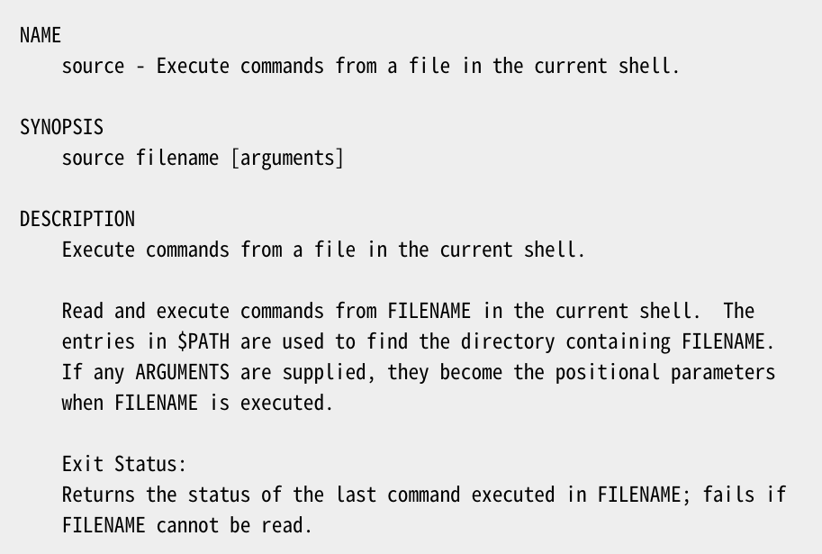

# source



## 作用

在当前shell会话中读取并执行文件中的命令。

## 用法

```
source filename
```

## 常见的使用场景

1. 刷新当前的shell环境

    ```
    source .bashrc
    ```

2. 在当前环境使用source执行shell脚本

    ```
    source filename.sh
    ```

3. 从脚本中导入一个函数到shell

    **func.sh**
    ```
    #!/bin/bash
    foo(){
        echo "test function!"
    }
    ```

    ```bash
    [root@localhost ~]# source func.sh 
    [root@localhost ~]# foo
    test function!
    ```

4. 从脚本中导入变量到shell

    **var.sh**
    ```
    #!/bin/bash
    a=1
    b=2
    c=3
    ```

    ```
    [root@localhost ~]# source var.sh
    ```

5. 把很多命令写在一个文件中一起执行

    **makeCommand.sh**
    ```bash
    make mrproper &&
    make menuconfig &&
    make dep &&
    make clean &&
    make bzImage &&
    make modules &&
    make modules_install &&
    cp arch/i386/boot/bzImge /boot/vmlinuz_new &&
    cp System.map /boot &&
    vi /etc/lilo.conf &&
    lilo -v
    ```

    ```bash
    source makeCommand.sh
    ```

## 带有参数的情况

**test.h**

``` bash
echo $1
echo $2
```

```
source test.sh a b
```

**output**
```
a
b
```

## 参考

https://linuxcommand.org/lc3_man_pages/sourceh.html

https://www.linuxprobe.com/linux-source-useful.html

https://blog.csdn.net/violet_echo_0908/article/details/52056071

https://gamehu.github.io/2019/05/15/Linux%20Source%E5%91%BD%E4%BB%A4/

https://linuxhandbook.com/source-command/