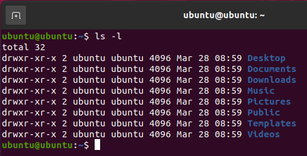
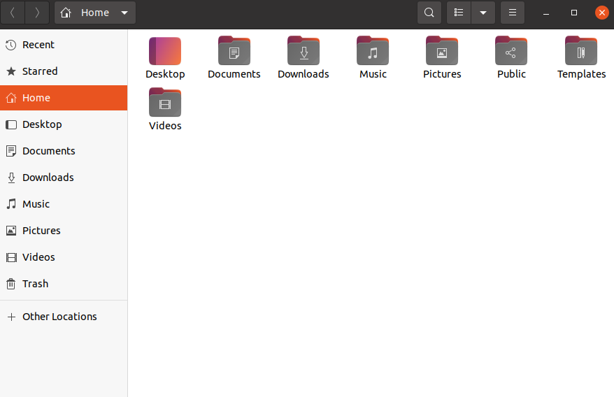

# 075 Shell和Shell script

不论你在使用哪一个主流的操作系统，都是在间接的与Shell进行交互。如果你运行的是Ubuntu、Linux Mint或任何其他Linux发行版，那么每次使用终端时都会与Shell进行交互。在本文中，将讨论linux Shell和Shell脚本。在使用Shell脚本之前，我们必须熟悉以下术语：

* 内核（Kernel）
* Shell
* 终端（Terminal）

### 1. 什么是内核（Kernel）

内核是一个计算机程序，它是计算机操作系统的核心，可以完全控制系统中的一切。它具有如下的功能：

* 文件管理
* 进程管理
* I/O管理
* 内存管理
* 设备管理
* ......

人们常常误以为Linus Torvalds开发了Linux操作系统，但实际上他只负责Linux内核的开发。

完整的Linux系统=内核+GNU系统实用程序和库+其他管理脚本+安装脚本等。

### 2. 什么是Shell

Shell是一个特殊的用户程序，它为用户提供一个使用操作系统服务的接口。Shell接受用户可读的命令，并将其转换为内核可以理解的内容。它是一个命令语言解释器，执行从键盘或文件等输入设备读取的命令。Shell在用户登录或启动终端时启动。

Shell大致分为两类:

* 命令行Shell
* 图形Shell

##### 2.1 命令行Shell

用户可以使用命令行界面访问Shell。linux/macOS中的终端或Windows操作系统中的命令提示符是一个特殊的程序，用于输入人类可读的命令，如`cat`、`ls`等，然后它被执行，结果随后在终端上显示给用户。Ubuntu20.04中的终端如下图所示：

在上面的屏幕截图中，执行带有`-l`参数的`ls`命令。它将以长列表格式列出当前工作目录中的所有文件。对于初学者来说，使用命令行Shell有点困难，因为很难记住这么多命令。它非常强大，允许用户将命令存储在文件中并一起执行。这样，任何重复的任务都可以轻松地自动化。这些文件通常在Windows中称为批处理文件，在Linux/macOS系统中称为Shell脚本。

##### 2.2 图形Shell

图形Shell提供了基于图形用户界面（GUI）操作程序的方法，比如通过打开、关闭、移动和调整窗口大小，以及在窗口之间切换焦点等动作来操作程序。Windows操作系统或Ubuntu操作系统可以被认为是一个很好的例子，它们为用户提供GUI，以便与程序进行交互。用户不需要为每个操作键入命令。Ubuntu系统中的典型GUI如下：

Linux系统可以使用很多种Shell，比如：

* BASH (Bourne Again SHell)：它是Linux系统中使用最广泛的Shell。它在Linux系统中用作默认登录Shell。它也可以安装在Windows操作系统上和Mac OS上。
* CSH (C SHell)：C Shell的语法和用法与C编程语言非常相似。
* KSH (Korn SHell)：Korn Shell也是POSIX Shell标准规范等的基础。

每个Shell执行相同的任务，但理解不同的命令，并提供不同的内置函数。

### 3. Shell脚本

通常，Shell是交互式的，这意味着它们接受来自用户的命令作为输入并执行它们。然而，有时我们想要执行一系列命令，这时我们要在终端中输入所有命令。由于Shell也可以从文件中获取命令作为输入，我们可以将这些命令写入文件，并在Shell中执行它们，以避免重复工作。这些文件称为Shell脚本或Shell程序。Shell脚本与MS-DOS中的批处理文件类似。每个Shell脚本都保存为扩展名为`.sh`的文件，例如`myscrip.sh`。

Shell脚本的语法与任何其他编程语言一样，如果你以前有过Python、C/C++等编程语言的经验，很容易就可以学会。

Shell脚本包含以下元素：

* Shell关键字–if、else、break等。
* Shell命令–cd、ls、echo、pwd、touch等。
* 函数。
* 控制流：if..then..else, case和其他循环等。

##### 我们为什么需要Shell脚本

编写Shell脚本有很多原因：

* 避免重复性工作，可以进行自动化工作。
* 系统管理员使用Shell脚本进行备份。
* 可以进行系统监视。
* 向Shell添加新功能等。

##### Shell脚本的优点

* 命令和语法与直接在命令行中输入的完全相同，所以程序员不需要学习完全不同的语法。
* 相比在终端输入，编写Shell脚本要快得多。
* 启动快速。
* 交互式调试等。

##### Shell脚本的缺点

* 出现错误时往往代价高昂，一个命令出现错误就会相差十万八千里。
* 执行速度慢。
* 语言语法有设计缺陷。
* 不太适合大而复杂的任务。
* 没有其他脚本语言那么丰富的数据结构。

### 参考

[Shell (computing) - Wikipedia](https://en.wikipedia.org/wiki/Shell_(computing))

[Shell script - Wikipedia](https://en.wikipedia.org/wiki/Shell_script)

[Introduction to Linux Shell and Shell Scripting - GeeksforGeeks](https://www.geeksforgeeks.org/introduction-linux-shell-shell-scripting/)