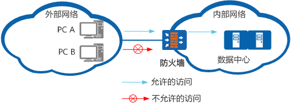

[原文地址：https://info.support.huawei.com/info-finder/encyclopedia/zh/ACL.html](https://info.support.huawei.com/info-finder/encyclopedia/zh/ACL.html)

# ACL

## 什么是ACL

访问控制列表ACL（Access Control List）是由一条或多条规则组成的集合。所谓规则，是指描述报文匹配条件的判断语句，这些条件可以是报文的源地址、目的地址、端口号等。
ACL本质上是一种报文过滤器，规则是过滤器的滤芯。设备基于这些规则进行报文匹配，可以过滤出特定的报文，并根据应用ACL的业务模块的处理策略来允许或阻止该报文通过。

## 为什么使用ACL

ACL作为一个过滤器，设备通过应用ACL来阻止和允许特定流量的流入和流出，如果没有它，任何流量都会自由流入和流出，使得网络容易受到攻击。

如下图所示，为保证财务数据安全，企业在路由设备上应用ACL可以阻止内网内部研发部门主机对财务服务器的访问，同时允许总裁办公室访问财务服务器。为了保护企业内网的安全，在路由设备上应用ACL可以封堵网络病毒常用的端口，防止Internet上的恶意流量入侵。

借助ACL，可以实现以下功能：

- 提供安全访问：企业重要服务器资源被随意访问，企业机密信息容易泄露，造成安全隐患。使用ACL可以指定用户访问特定的服务器、网络与服务，从而避免随意访问的情况。
- 防止网络攻击：Internet病毒肆意侵略企业内网，内网环境的安全性堪忧。使用ACL可以封堵高危端口，从而达成为外网流量的阻塞。
- 提高网络带宽利用率：网络带宽被各类业务随意挤占，服务质量要求最高的语音、视频业务的带宽得不到保障，造成用户体验差。使用ACL实现对网络流量的精确识别和控制，限制部分网络流量从而保障主要业务的质量。

## ACL的组成

ACL的每一条规则都会允许或者阻止特定的流量，在定义一条合理的ACL规则之前，需要了解其基本组成。

- ACL标识：使用数字或者名称来标识ACL。
    - 使用数字标识ACL：不同的类型的ACL使用不同的数字进行标识。
    - 使用名称标识ACL：可以使用字符来标识ACL，就像用域名代替IP地址一样，更加方便记忆。

- 规则：即描述匹配条件的判断语句。
    - 规则编号：用于标识ACL规则，所有规则均按照规则编号从小到大进行排序。
    - 动作：包括permit/deny两种动作，表示设备对所匹配的数据包接受或者丢弃。
    - 匹配项：ACL定义了极其丰富的匹配项。包括生效时间段、IP协议（ICMP、TCP、UDP等）、源/目的地址以及相应的端口号（21、23、80等）。关于每种匹配项的详细介绍，请参见ACL的常用匹配项。

## ACL的分类

随着ACL技术的发展，其种类越来越丰富，根据其不同的规则和使用场景，常用的可分为以下几类：

**基本ACL**
基本ACL规则只包含源IP地址，对设备的CPU消耗较少，可用于简单的部署，但是使用场景有限，不能提供强大的安全保障。

**高级ACL**
相较于基本ACL，高级ACL提供更高的扩展性，可以对流量进行更精细的匹配。通过配置高级ACL，可以阻止特定主机或者整个网段的源或者目标。除此之外，还可以使用协议信息（IP、ICMP、TCP、UDP）去过滤相应的流量。

**二层ACL**
在公司的内部网络中，想对特定的终端进行访问权限控制，这时就需要二层ACL。使用二层ACL，可以根据源MAC地址、目的MAC地址、802.1p优先级、二层协议类型等二层信息对流量进行管控。

**用户ACL**
由于企业内部同部门的工作人员的终端不在同一个网段难以管理，需要将其纳入一个用户组，并对其用户组进行访问权限管理，这时候就需要用户ACL。用户ACL在高级ACL的基础上增加了用户组的配置项，可以实现对不同用户组的流量管控。

不同类型的ACL的具体组成如下表所示：

## 如何使用ACL

### 使用步骤

1. 设置相应的ACL规则。

    为ACL设置相关规则的时候，需要了解入口流量与出口流量，如下图所示：入口流量指的是进入设备（以路由器为例）接口的流量（无论来源是外部Internet还是内部网络），同理，出口流量指的是从设备接口流出的流量。

    

    当外部Internet访问内部网络时，通过路由器接口2的入口流量，其源IP地址为外部的公网IP；而当内部网络需要访问外部网络时，通过路由器的接口1的入口流量，其源IP地址则为内网的IP。

2. 将ACL应用在相应的设备接口的特定方向（in/out）上。
    规则设置完成后，需要将ACL应用在设备的接口上才能正常工作。因为所有的路由和转发决策都是由设备的硬件做出的，所以ACL语句可以更快地执行。

### 匹配机制

设备使用ACL的匹配机制如下图所示。

ACL规则的匹配遵循”一旦命中即停止匹配”的机制。当ACL处理数据包时，一旦数据包与某条ACL规则匹配，就会停止匹配，设备根据该条匹配的语句内容决定允许或者拒绝该数据包。如果数据包内容与ACL语句不匹配，那么将依次使用ACL列表中的下一条语句去匹配数据包直到列表的末尾。一般在ACL的列表末尾会有一条隐式的拒绝所有的语句，所以数据包与所有的规则都不匹配的情况下会被直接拒绝。此时设备不会将此数据包流入或流出接口，而是直接将其丢弃。

### ACL的应用场景

### 在NAT中使用ACL

通过NAT的端口映射可使得外网访问内部网络。考虑到内部的网络安全，不可能允许所有的外部用户访问内部网络，这时可以设置ACL规则并应用在企业路由器上，使得特定的外网用户可以访问内部网络。

如上图所示，当公网主机想建立与内网主机的通信时，其发向内部网络主机的流量经过NAT设备时，设备利用ACL对流量进行过滤，阻断了PC4对PC2的访问，同时允许PC3对PC1的访问。

### 在防火墙中使用ACL

防火墙用在内外网络边缘处，防止外部网络对内部网络的入侵，也可以用来保护网络内部大型服务器和重要的资源（如数据）。由于ACL直接在设备的转发硬件中配置，在防火墙中配置ACL在保护网络安全的同时不会影响服务器的性能。

如上图所示，在防火墙上配置ACL只允许外部特定主机PC A访问内部网络中的数据中心，并禁止其他外部主机的访问。

### 在QoS中使用ACL限制用户互访

ACL应用在QoS的流策略中，可以实现不同网段用户之间访问权限的限制，从而避免用户之间随意访问形成安全隐患。

如上图所示，某公司为财务部和市场部规划了两个网段的IP地址。为了避免两个部门之间相互访问造成公司机密的泄露，可以在两个部门连接Router的接口的入方向上应用绑定了ACL的流策略，从而禁止两个部门的互访。

