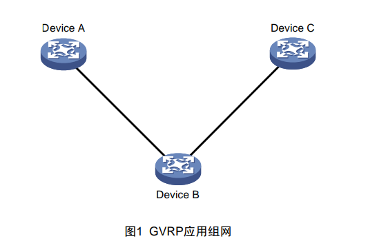

[原文地址：https://www.h3c.com/cn/d_200806/608905_30003_0.htm](https://www.h3c.com/cn/d_200806/608905_30003_0.htm)

# GVRP技术白皮书

**关键词：** GARP，GVRP，属性，注册，VLAN

**摘 要：** GVRP可以实现VLAN的动态配置，本文介绍了GVRP协议的基本原理和典型应用。

|缩略词|英文全名|中文解释|
|----|---------|---------|
|GARP|Generic Attribute Registration Protocol|通用属性注册协议|
|GMRP|GARP Multicast Registration Protocol |组播属性注册协议|
|GVRP|GARP VLAN Registration Protoco|VLAN属性注册协议|
|MSTP|Multiple Spanning Tree Protocol |多生成树协议|

## 1 概述

GARP协议主要用于建立一种属性传递扩散的机制，以保证协议实体能够注册和注销该属性。GARP作为一个属性注册协议的载体，可以用来传播属性。将GARP协议报文的内容映射成不同的属性即可支持不同上层协议应用。例如，GMRP和GVRP：

* GMRP 是 GARP 的一种应用，用于注册和注销组播属性；
* GVRP 是 GARP 的一种应用，用于注册和注销 VLAN 属性。

GARP协议通过目的MAC地址区分不同的应用。在IEEE Std 802.1D中将01-80-C2-00-00-20分配给组播应用，即GMRP。在IEEE Std 802.1Q中将01-80-C2-00-00-21分配给VLAN应用，即GVRP。

本文仅介绍GVRP的相关知识

### 1.1 产生背景

如果需要为网络中的所有设备都配置某些VLAN，就需要网络管理员在每台设备上分别进行手工添加。如图1所示，Device A上有VLAN 2，Device B和Device C上只有VLAN 1，三台设备通过Trunk链路连接在一起。为了使Device A上VLAN 2的报文可以传到Device C，网络管理员必须在Device B和Device C上分别手工添加VLAN 2。

对于上面的组网情况，手工添加VLAN很简单，但是当实际组网复杂到网络管理员无法短时间内完全了解网络的拓扑结构，或者是整个网络的VLAN太多时，工作量会非常大，而且非常容易配置错误。在这种情况下，用户可以通过GVRP的VLAN自动注册功能完成VLAN的配置。

### 1.2 技术优点

GVRP基于GARP机制，主要用于维护设备动态VLAN属性。通过GVRP协议，一台设备上的VLAN信息会迅速传播到整个交换网。GVRP实现动态分发、注册和传播VLAN属性，从而达到减少网络管理员的手工配置量及保证VLAN配置正确的目的。

## 2 技术实现方案

### 2.1 概念介绍

#### 2.1.1 应用实体

在设备上，每一个参与协议的端口可以视为一个应用实体。当GVRP在设备上启动的时候，每个启动GVRP的端口对应一个GVRP应用实体，如图2所示。

#### 2.1.2 VLAN的注册和注销

GVRP协议可以实现VLAN属性的自动注册和注销：

* VLAN 的注册：指的是将端口加入 VLAN。
* VLAN 的注销：指的是将端口退出 VLAN。

GVRP协议通过声明和回收声明实现VLAN属性的注册和注销。

* 当端口接收到一个 VLAN 属性声明时，该端口将注册该声明中包含的 VLAN信息（端口加入 VLAN）。
* 当端口接收到一个 VLAN 属性的回收声明时，该端口将注销该声明中包含的VLAN 信息（端口退出 VLAN）。

GVRP协议的属性注册和注销仅仅是对于接收到GVRP协议报文的端口而言的。

#### 2.1.3 消息类型

GARP应用实体之间的信息交换借助于消息的传递来完成，主要有三类消息起作用，分别为Join消息、Leave消息和LeaveAll消息。

1. Join消息

    当一个GARP应用实体希望其它设备注册自己的属性信息时，它将对外发送Join消息；当收到其它实体的Join消息或本设备静态配置了某些属性，需要其它GARP应用实体进行注册时，它也会向外发送Join消息。

    Join消息分为JoinEmpty和JoinIn两种，区别如下：
    * JoinEmpty：声明一个本身没有注册的属性。
    * JoinIn：声明一个本身已经注册的属性。

2. Leave消息

    当一个GARP应用实体希望其它设备注销自己的属性信息时，它将对外发送Leave消息；当收到其它实体的Leave消息注销某些属性或静态注销了某些属性后，它也会向外发送Leave消息。

    Leave消息分为LeaveEmpty和LeaveIn两种，区别如下：
    * LeaveEmpty：注销一个本身没有注册的属性。
    * LeaveIn：注销一个本身已经注册的属性

3. LeaveAll消息

    每个应用实体启动后，将同时启动LeaveAll定时器，当该定时器超时后应用实体将对外发送LeaveAll消息。

    LeaveAll消息用来注销所有的属性，以使其它应用实体重新注册本实体上所有的属性信息，以此来周期性地清除网络中的垃圾属性（例如某个属性已经被删除，但由于设备突然断电，并没有发送Leave消息来通知其他实体注销此属性）。

#### 2.1.4 定时器

GARP协议中用到了四个定时器,下面分别介绍一下它们的作用。

1. Join定时器

    Join定时器是用来控制Join消息(包括JoinIn和JoinEmpty)的发送的。

    为了保证Join消息能够可靠的传输到其它应用实体,发送第一个Join消息后将等待一个Join定时器的时间间隔,如果在一个Join定时器时间内收到JoinIn消息,则不发送第二个Join消息;如果没收到,则再发送一个Join消息。每个端口维护独立的Join定时器。

2. Hold定时器

    Hold定时器是用来控制Join消息(包括JoinIn和JoinEmpty)和Leave消息(包括LeaveIn和LeaveEmpty)的发送的。

    当在应用实体上配置属性或应用实体接收到消息时不会立刻将该消息传播到其它设备,而是在等待一个Hold定时器后再发送消息,设备将此Hold定时器时间段内接收到的消息尽可能封装成最少数量的报文,这样可以减少报文的发送量。如果没有Hold定时器的话,每来一个消息就发送一个,造成网络上报文量太大,既不利于网络的稳定,也不利于充分利用每个报文的数据容量。

    每个端口维护独立的Hold定时器。Hold定时器的值要小于等于Join定时器值的一半。

3. Leave定时器

    Leave定时器是用来控制属性注销的。

    每个应用实体接收到Leave或LeaveAll消息后会启动Leave定时器,如果在Leave定时器超时之前没有接收到该属性的Join消息,属性才会被注销。这是因为网络中如果有一个实体因为不存在某个属性而发送了Leave消息,并不代表所有的实体都不存在该属性了,因此不能立刻注销属性,而是要等待其他实体的消息。例如,某个属性在网络中有两个源,分别在应用实体A和B上,其他应用实体通过协议注册了该属性。当把此属性从应用实体A上删除的时候,实体A发送Leave消息,由于实体B上还存在该属性源,在接收到Leave消息之后,会发送Join消息,以表示它还有该属性。其他应用实体如果收到了应用实体B发送的Join消息,则该属性仍然被保留,不会被注销。只有当其它应用实体等待两个Join定时器以上仍没有收到该属性的Join消息时,才能认为网络中确实没有该属性了,所以这就要求Leave定时器的值大于2倍Join定时器的值。

    每个端口维护独立的Leave定时器。

4. LeaveAll定时器

    每个GARP应用实体启动后,将同时启动LeaveAll定时器,当该定时器超时后GARP应用实体将对外发送LeaveAll消息,随后再启动LeaveAll定时器,开始新的一轮循环。

    接收到LeaveAll消息的实体将重新启动所有的定时器,包括LeaveAll定时器。在自己的LeaveAll定时器重新超时之后才会再次发送LeaveAll消息,这样就避免了短时间内发送多个LeaveAll消息。

    如果不同设备的LeaveAll定时器同时超时,就会同时发送多个LeaveAll消息,增加不必要的报文数量,为了避免不同设备同时发生LeaveAll定时器超时,实际定时器运行的值是大于LeaveAll定时器的值,小于1.5倍LeaveAll定时器值的一个随机值。

    一次LeaveAll事件相当于全网所有属性的一次Leave。由于LeaveAll影响范围很广,所以建议LeaveAll定时器的值不能太小,至少应该大于Leave定时器的值。

    每个设备只在全局维护一个LeaveAll定时器。

#### 2.1.5 注册模式

手工配置的VLAN称为静态VLAN,通过GVRP协议创建的VLAN称为动态VLAN。GVRP有三种注册模式,不同的模式对静态VLAN和动态VLAN的处理方式也不同。GVRP的三种注册模式分别定义如下:

* Normal 模式:允许动态 VLAN 在端口上进行注册,同时会发送静态 VLAN 和动态 VLAN 的声明消息。
* Fixed 模式:不允许动态 VLAN 在端口上注册,只发送静态 VLAN 的声明消息。
* Forbidden 模式:不允许动态 VLAN 在端口上进行注册,同时删除端口上除VLAN 1 外的所有 VLAN,只发送 VLAN 1 的声明消息。

### 2.2 报文结构

GARP协议报文采用IEEE 802.3 Ethernet封装形式,报文结构如图4所示。

各个字段的说明如下表所示。

|字段|含义|取值|
|--|--|--|
|Protocol ID|协议ID|取值为1,代表GARP协议|
|Message|消 息 , 每 个 Message 由 Attribute Type、Attribute List构成|-|
|Attribute Type|属性类型,由具体的GARP的应用定义|对于GVRP,属性类型为0x01,表示属性取值为VLAN ID|
|Attribute List|属性列表,由多个属性构成|-|
|Attribute|属性,每个属性由Attribute Length、Attribute Event 、 Attribute Value 构成|-|
|Attribute Length|属性长度(包括长度字段本身)|2~255,单位为字节|
|Attribute Event|属性描述的事件|0:LeaveAll Event  1:JoinEmpty Event  2:JoinIn Event  3:LeaveEmpty Event  4:LeaveIn Event|
|Attribute Value|属性取值|GVRP的属性取值为VLAN ID,但LeaveAll属性的此值无效|
|End Mark|结束标志、GARP的PDU的结尾标志|以0x00取值表示|

### 2.3 工作过程

下面通过一个简单的例子来介绍一下GVRP的工作过程。该例子分四个阶段描述了一个VLAN属性在网络中是如何被注册和注销的。

1. VLAN属性的单向注册

    

    在Device A上创建静态VLAN 2,通过VLAN属性的单向注册,将Device B和DeviceC的相应端口自动加入VLAN 2:

    * 在 Device A 上创建静态 VLAN 2 后,Port 1 启动 Join 定时器和 Hold 定时器,等待 Hold 定时器超时后,Device A 向 Device B 发送第一个 JoinEmpty消息,Join 定时器超时后再次启动 Hold 定时器,再等待 Hold 定时器超时后,发送第二个 JoinEmpty 消息。

    * Device B 上接收到第一个 JoinEmpty 后创建动态 VLAN 2,并把接收到JoinEmpty 消息的 Port 2 加入到动态 VLAN 2 中,同时告知 Port 3 启动 Join定时器和 Hold 定时器,等待 Hold 定时器超时后向 Device C 发送第一个JoinEmpty 消息,Join 定时器超时后再次启动 Hold 定时器,Hold 定时器超时之后,发送第二个 JoinEmpty 消息。Device B 上收到第二个 JoinEmpty后,因为 Port 2 已经加入动态 VLAN 2,所以不作处理。

    * Device C 上接收到第一个 JoinEmpty 后创建动态 VLAN 2,并把接收到JoinEmpty 消息的 Port 4 加入到动态 VLAN 2 中。Device C 上收到第二个JoinEmpty 后,因为 Port 4 已经加入动态 VLAN 2,所以不作处理。

    * 此后,每当 Leaveall 定时器超时或收到 LeaveAll 消息,设备会重新启动Leaveall 定时器、Join 定时器、Hold 定时器和 Leave 定时器。Device A 的Port 1 在 Hold 定时器超时之后发送第一个 JoinEmpty 消息,再等待 Join 定时器+Hold 定时器之后,发送第二个 JoinEmpty 消息,Device B 向 Device C发送 JoinEmpty 消息的过程也是如此。

2. VLAN属性的双向注册

    

    通过上述VLAN属性的单向注册过程,端口Port 1、Port 2、Port 4已经加入VLAN 2,但是Port 3还没有加入VLAN 2(只有收到JoinEmpty消息或JoinIn消息的端口才能加入动态VLAN) 。为使VLAN 2流量可以双向互通 ,需要进行 Device C到Device A方向的VLAN属性的注册过程:

    * VLAN 属性的单向注册完成后,在 Device C 上创建静态 VLAN 2(将动态VLAN 转换成静态 VLAN),Port 4 启动 Join 定时器和 Hold 定时器,等待Hold 定时器超时后,Device C 向 Device B 发送第一个 JoinIn 消息(因为Port 4 已经注册了 VLAN 2,所以发送 JoinIn 消息),Join 定时器超时后再次启动 Hold 定时器,Hold 定时器超时之后,发送第二个 JoinIn 消息。

    * Device B 上接收到第一个 JoinIn 后,把接收到 JoinIn 消息的 Port 3 加入到动态 VLAN 2 中,同时告知 Port 2 启动 Join 定时器和 Hold 定时器,等待 Hold定时器超时后,向 Device A 发送第一个 JoinIn 消息,Join 定时器超时后再次启动 Hold 定时器,Hold 定时器超时之后,发送第二个 JoinIn 消息;Device B 上收到第二个 JoinIn 后,因为 Port 3 已经加入动态 VLAN 2,所以不作处理。

    * Device A 上接收到 JoinIn 之后,停止向 Device B 发送 JoinEmpty 消息。此后,当 Leaveall 定时器超时或收到 LeaveAll 消息,设备重新启动 Leaveall 定时器、Join 定时器、Hold 定时器和 Leave 定时器。Device A 的 Port 1 在Hold 定时器超时之后就开始发送 JoinIn 消息;

    * Device B 向 Device C 发送 JoinIn 消息。

    * Device C 收到 JoinIn 消息后,由于本身已经创建了静态 VLAN 2,所以不会再创建动态 VLAN 2。

3. VLAN属性的单向注销

    

    当设备上不再需要VLAN 2时,可以通过VLAN属性的注销过程将VLAN 2从设备上删除:

    * 在 Device A 上删除静态 VLAN 2,Port 1 启动 Hold 定时器,等待 Hold 定时器超时后,Device A 向 Device B 发送 LeaveEmpty 消息。LeaveEmpty 消息只需发送一次。

    * Device B 上接收到 LeaveEmpty,Port 2 启动 Leave 定时器,等待 Leave 定时器超时之后 Port 2 注销 VLAN 2,将 Port 2 从动态 VLAN 2 中删除(由于此时 VLAN 2 中还存在端口 Port 3,所以不会删除 VLAN 2),同时告知 Port 3 启动 Hold 定时器和 Leave 定时器,等待 Hold 定时器超时后,向 Device C 发送 LeaveIn 消息。由于 Device C 的静态 VLAN 2 还没有删除,Port 3 在Leave 定时器超时之前仍然能够收到 Port 4 发送的 JoinIn 消息,所以 Device A 和 Device B 上仍然能够学习到动态的 VLAN 2。

    * Device C 上接收到 LeaveIn 后,由于 Device C 上存在静态 VLAN 2,所以Port 4 不会从 VLAN 2 中删除。

4. VLAN属性的双向注销

    

    为了彻底删除所有设备上的VLAN 2,需要进行VLAN属性的双向注销:

    * 在 Device C 上删除静态 VLAN 2,Port 4 启动 Hold 定时器,等待 Hold 定时器超时后,Device C 向 Device B 发送 LeaveEmpty 消息;

    * Device B 接收到 LeaveEmpty 消息后,Port 3 启动 Leave 定时器,等待Leave 定时器超时之后 Port 3 注销 VLAN 2,将 Port 3 从动态 VLAN 2 中删除并删除动态 VLAN 2,同时告知 Port 2 启动 Hold 定时器,等待 Hold 定时器超时后,向 Device A 发送 LeaveEmpty 消息。

    * Device A 接收到 LeaveEmpty 消息后,Port 1 启动 Leave 定时器,等待Leave 定时器超时之后 Port 1 注销 VLAN 2,将 Port 1 从动态 VLAN 2 中删除并删除动态 VLAN 2。

### 2.4 应用限制

* 启用业务环回功能后 GVRP 报文发送不出去,所以 GVRP 功能与业务环回功能不可以同时应用。

* GVRP 功能只能运行在 MSTP 的 CIST 实例上,并且在 CIST 实例上被MSTP 阻塞的端口不能收发 GVRP 报文。

## 3 典型组网应用

GVRP特性使得不同设备上的VLAN信息可以由协议动态维护和更新,用户只需要对少数设备进行VLAN配置即可应用到整个交换网络,无需耗费大量时间进行拓扑分析和配置管理。

图9中所有设备都使能GVRP功能,设备之间相连的端口均为Trunk端口,并允许所有VLAN通 过。只需在 Device A和 Device G上 分别手工配 置静态VLAN 100~1000,那么,设备Device B~Device F就可以通过GVRP协议学习到这些VLAN,最后各设备上都存在VLAN 100~1000。

## 4 展望

GVRP是一种VLAN的动态配置技术,在复杂的组网环境中应用GVRP,能够简化VLAN配置管理,减少因为配置不一致而导致的网络互通问题。此外,没有收到VLAN注册消息的端口不会加入动态VLAN,从而实现了VLAN的裁减,抑制了不必要的流量。随着GVRP支持MSTP多实例,在未来的组网应用中,GVRP将会得到更广泛的应用。

## 5 参考文献

* IEEE Std 802.1D
* IEEE Std 802.1Q