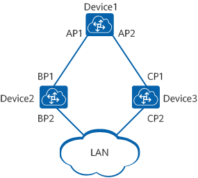

[原文地址https://info.support.huawei.com/info-finder/encyclopedia/zh/STP.html](https://info.support.huawei.com/info-finder/encyclopedia/zh/STP.html)

# 什么是STP

STP（Spanning Tree Protocol）是一个用于局域网中消除环路的协议，它的标准是IEEE 802.1D。STP通过将部分冗余链路强制为阻塞状态，其他链路处于转发状态，将环形网络结构修剪成无环路的树形网络结构，可实现消除环路。当处于转发状态的链路不可用时，STP重新配置网络，并激活合适的备用链路状态，恢复恢复网络连通性。

# 为什么需要STP

在一个复杂的网络环境中，由于冗余备份的需要，网络设计者都倾向于在设备之间部署多条物理链路，其中一条作主用链路，其他链路作备份，偶然或必然中都会导致环路产生。环路会产生广播风暴，最终导致整个网络资源被耗尽，网络瘫痪不可用。环路还会引起MAC地址表震荡导致MAC地址表项被破坏。

STP技术可以有效的解决环路问题，将彼此交互信息发现网络中的环路，将部分冗余链路强制为阻塞状态，其他链路处于转发状态。最终将环形网络结构修剪成无环路的树形网络结构，从而防止报文在环形网络中不断增生和无限循环，避免设备由于重复接收相同的报文造成处理能力下降。

# STP vs RSTP vs MSTP

STP包含两种含义：

- 狭义的STP是指IEEE 802.1D中定义的STP协议。
- 广义的STP包括IEEE 802.1D中定义的STP、IEEE 802.1W中定义的快速生成树协议RSTP（Rapid Spanning Tree Protocol）和IEEE 802.1S中定义的多生成树协议MSTP（Multiple Spanning Tree Protocol）。

目前，生成树协议支持如下：

- STP是基础的数据链路层的管理协议，用于二层网络的环路检测和预防。但是，STP拓扑收敛速度慢。
- RSTP在STP基础上进行了改进，实现了网络拓扑快速收敛。但RSTP和STP还存在同一个缺陷：局域网内所有的VLAN共享一棵生成树，不能按VLAN阻塞冗余链路，所有VLAN的报文都沿着一棵生成树进行转发。
- MSTP通过设置VLAN映射表（即VLAN和生成树实例的对应关系表），把VLAN和生成树实例联系起来。同时它把一个交换网络划分成多个域，每个域内形成多棵生成树实例，生成树实例之间彼此独立。MSTP提供了数据转发的多个冗余路径，在数据转发过程中实现VLAN数据的负载均衡。

生成树协议中，MSTP兼容RSTP、STP，RSTP兼容STP。三种生成树协议的比较如下表所示。

| **生成树协议** | **特点**                                                     | 应用场景                                                     |
| -------------- | ------------------------------------------------------------ | ------------------------------------------------------------ |
| STP            | 形成一棵无环路的树，解决广播风暴并实现冗余备份。收敛速度较慢。 | 无需区分用户或业务流量，所有VLAN共享一棵生成树。             |
| RSTP           | 形成一棵无环路的树，解决广播风暴并实现冗余备份。 收敛速度快。 |                                                              |
| MSTP           | 形成多棵无环路的树，解决广播风暴并实现冗余备份。  收敛速度快。 多棵生成树在VLAN间实现负载均衡，不同VLAN的流量按照不同的路径转发。 | 需要区分用户或业务流量，并实现负载分担。不同的VLAN通过不同的生成树转发流量，每棵生成树之间相互独立。 |

# STP是如何工作的

## STP的基本概念

从环形网络拓扑结构到树形结构，总体来说有三个要素：根桥、根端口和指定端口。

**根桥**：对于一个STP网络，根桥在全网中只有一个，它是整个网络的逻辑中心，但不一定是物理中心。在进行根桥的选择时，一般会选择性能高、网络层次高的交换设备作为根桥。根桥会根据网络拓扑的变化而动态变化。

**根端口**：去往根桥路径开销最小的端口，根端口负责向根桥方向转发数据，这个端口的选择标准是依据路径开销判定。在一台设备上所有使能STP的端口中，根路径开销最小者，就是根端口。很显然，在一个运行STP协议的设备上根端口有且只有一个，根桥上没有根端口。

**指定端口**：指定桥与指定端口的描述见下表。

| **分类**           | **指定桥**                                     | **指定端口**                     |
| ------------------ | ---------------------------------------------- | -------------------------------- |
| 对于一台设备而言   | 与本机直接相连并且负责向本机转发配置消息的设备 | 指定桥向本机转发配置消息的端口   |
| 对于一个局域网而言 | 负责向本网段转发配置消息的设备                 | 指定桥向本网段转发配置消息的端口 |

如下图所示，AP1、AP2、BP1、BP2、CP1、CP2分别表示设备Device1、Device2、Device3的端口。

- Device1通过端口AP1向Device2转发配置消息，则Device2的指定桥就是Device1，指定端口就是Device1的端口AP1。
- 与局域网LAN相连的有两台设备：Device2和Device3，如果Device2负责向LAN转发配置消息，则LAN的指定桥就是Device2，指定端口就是Device2的BP2。

此外，设备和端口都有ID，分别是桥ID（BID）和端口ID（PID）。端口ID由端口优先级和端口号组成。桥ID由桥优先级和桥MAC两部分组成，在STP网络中，桥ID最小的设备会被选举为根桥。

## STP的实现过程

STP的基本实现过程如下：

