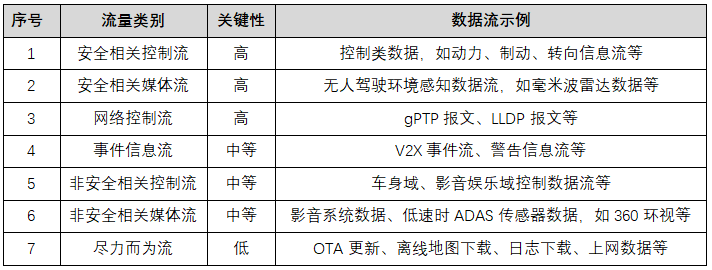
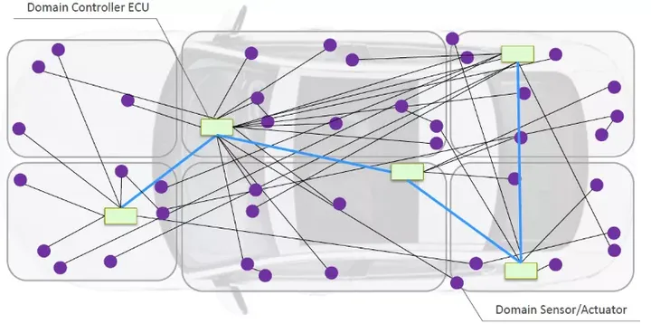
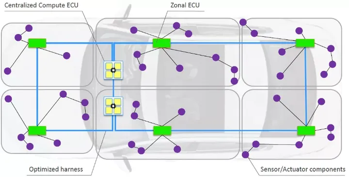
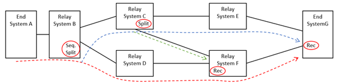
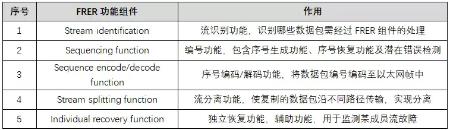
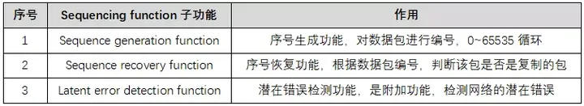
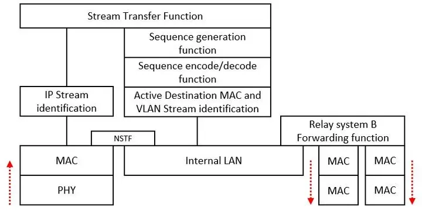
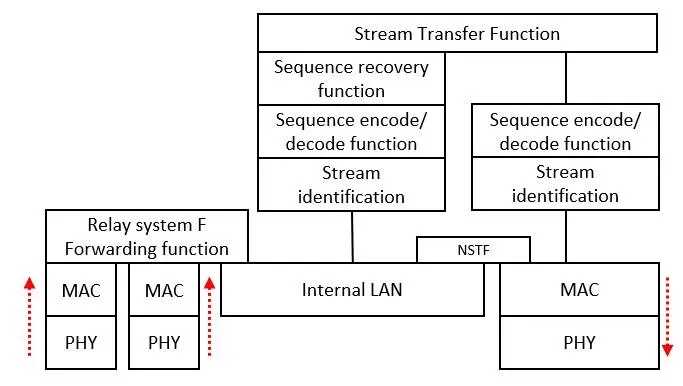

[原文地址：https://zhuanlan.zhihu.com/p/381765532](https://zhuanlan.zhihu.com/p/381765532)

# dot1cb

在车载通信领域，我们时常面临一个困惑，要是通信线路异常断开了怎么办？这里的异常断开不仅指物理上的断开，也可能是受电磁干扰等导致线路通信功能的异常等。解决此类问题，一个显而易见的解决方案就是增加冗余路径，即把数据传输2~N份以进行备份，这样就不用担心数据的丢失了。

原理很简单，但受限于成本因素及协议原理等，实现起来并不容易。常见的车载通信协议——CAN/LIN/FlexRay/Most/Ethernet，只有FlexRay和Ethernet能实现上述的冗余通信。FlexRay可使用双通道通信，两个通道可用来发送相同的信息，以牺牲通信速率的代价来换取冗余传输。但FlexRay通信速率有限，单通道最高通信速率为10Mbps，该速率对传输车内线控信号足够，但用于传输无人驾驶相关的传感器信号，就捉襟见肘了。以太网可实现通信速率（百兆、千兆等）与冗余传输的兼顾，是一个优质的解决方案，但受限于汽车电气拓扑、芯片等的发展水平，现阶段该技术暂未推广，但不可否认该技术的强大。今天小怿就带领大家认识认识以太网实现冗余的方案，即TSN协议族中的IEEE 802.1 CB协议。

IEEE 802.1 CB协议定义了车载以太网中实现冗余传输的方案，协议全称Frame Replication and Elimination for Reliability，简称FRER。下面小怿将依次介绍该协议的应用场景、协议原理、实现方式等。

## 应用场景

理论上讲，整车各类数据流可进行以下区分，如下表所示：

表 1 数据流量类别

上表中，关键性列为“高”的数据流，理应进行冗余传输，以实现更高级别的功能安全。一般来讲，是否使用冗余协议，由功能决定，如果某功能对数据的丢包无法容忍，那么，需考虑使用冗余协议FRER以实现可靠传输。

使用FRER实现冗余时，前提条件是网络中数据的传输有冗余路径—备选路径，这就对网络拓扑的形式提出了要求：网络中必须能够形成环路，以使Talker端的数据能沿不同路径到达Listener端。以下两图可直观理解FRER对网络拓扑形式的需求。图1域控制器架构中，各域节点通过以太网连接在一起，域内各节点通过CAN/Ethernet等互联，域节点之间未形成环形拓扑，因此，无法使用FRER进行冗余设计。图2 Zonal架构中，主干网上以太网节点数量增多，节点的处理能力及可靠性要求更高，网络中也形成了闭环，此时，可使用FRER使数据沿不同路径传输，以实现高可靠性。

图 1 典型域控制器架构（摘自“Automotive Plug and Play from theory to implementation”报告）

图 2 Zonal架构（摘自“Automotive Plug and Play from theory to implementation”报告）

总之，FRER应用于对数据传输有高可靠性需求，且网络可提供数据传输冗余路径的以太网拓扑中。

## 协议原理

FRER原理简单：Talker端发送数据时，FRER功能将数据包复制，沿不同路径传输；Listener端接收数据时，FRER功能删除复制的数据包，只保留一个数据包。当然，不强制要求作为终端节点的Talker或Listener支持FRER功能，FRER功能可通过网桥来实现，此时，网桥称为Talker的代理或Listener的代理。

下图中，End System A是数据流的Talker端，End System G是数据流的Listener端，两者之间有多个交换机Relay System。终端A不具备FRER功能，需由交换机B进行代理，此时，B称为Talker（终端A）的FRER代理；G具备FRER功能，其不需要代理。虚线表示数据流及其流动方向，红色圆框表示节点具备的FRER功能（主要功能，非全部功能）。

图 3 FRER原理示意图

要想实现数据流沿不同路径（甚至是所有可能路径）的传输，需要由多个节点配合实现，各节点需具备不同的FRER功能，以共同实现数据的冗余传输。FRER功能组件如表2所示：

表 2 FRER功能组件

上表中，Sequencing function有3个子功能，见表3：

表 3 Sequencing function子功能

FRER所有的功能组件均与两个参数相关，即stream_handle子参数及sequence_number子参数。

* stream_handle子参数与流识别功能相关，节点根据数据帧的MAC、VLAN、Priority、IP等信息，判断数据帧是否需经过FRER功能组件处理，如需进行处理，给其分配一个stream_handle子参数，该stream_handle子参数决定了数据帧会经过哪些FRER组件的处理，所有具备FRER功能的节点，其必须具备Stream identification功能。

* sequence_number子参数与数据帧的复制及删除相关，在Talker端，对数据包按序进行编号，并将sequence_number编码至数据帧中；在数据接收方，根据sequence_number子参数判定数据帧是否是之前接收包的复制品，如果是，即删除。

以图3的系统为例，节点B、C、F及G具备FRER功能的节点，以节点B及F为例，其内部详情如下。

**节点B（交换机，Talker端FRER代理）**

节点B中，对于从A节点处来的数据流，其处理流程如下：

（1）Stream identification组件使用IP地址等对数据流进行识别，如果需要进行FRER处理，则传往高层由FRER组件进行处理；如不需要，则通过NSTF传输，不经过FRER功能组件；

（2）Sequence generation function组件对数据包进行编号，从0~65535循环；

（3）Sequence encode function将（2）中的编号编码进数据帧中，以使数据帧携带编号信息；

（4）Active Destination MAC and VLAN Stream identification组件改变数据包的MAC、VLAN等信息，进而使数据包沿不同的路径传输；其取代了流分离的功能。

**节点F（交换机，两条路径在此交汇）**

节点F中，两条不同路径上的数据流在此处汇聚，节点F的处理流程如下：

（1）Stream identification组件对数据流进行识别，对需经过FRER功能组件处理的数据帧传往高层处理；

（2）Sequence decode function组件去除数据帧中编码的sequence_number子参数等内容，以使数据帧能被Stream Transfer Function识别；

（3）Sequence recovery function根据数据包的sequence_number子参数，判断数据包是否是之前接收的数据包的复制包，如果不是，则保留该包，如果是，则删除。

（4）Sequence encode function组件往数据帧中编码sequence_number子参数，以使报文携带编号信息，方便后续节点进行帧删除操作。

（5）Stream identification组件视需改变数据帧的MAC或VLAN。

以上是FRER协议的基本原理，其实，每一个FRER功能组件的背后，都需进行复杂的参数配置，可能涉及复杂的算法，篇幅原因，本文不进行具体讲述。FRER协议原理简单，但深入理解并使用不是一件容易的事。

## 实现方式

在第1章节提到过，FRER应用于网络中能形成回环的网络，数据流的传输路径，需提前静态配置。

一般来讲，FRER功能组件的布置很灵活。在静态配置好的数据传输路径上，节点或交换机根据其自身所在位置，选用合适的FRER功能组件，各节点配合实现系统中数据流的冗余传输。各节点选用的FRER组件，一般遵循以下原则：

（1）Talker端（或Talker的FRER代理端）需支持流识别功能、序号生成功能、序号编码功能、流分离功能（可由流识别功能实现）

（2）Listener端（或Listener的FRER代理端）需支持流识别功能、序号恢复功能及潜在错误检测功能、序号解码功能

（3）如果路径上某交换机是2~N条路径的交汇节点，该节点需支持流识别功能、序号恢复功能及潜在错误检测功能、序号编码/解码功能

（4）如果路径上某交换机处分离出2~N条路径，该节点需支持流识别功能、序号编码/解码功能、流分离功能（可由流识别功能实现）

（5）任何具备FRER功能组件的节点，均需支持流识别功能

## 总结

IEEE 802.1 CB协议是TSN协议族的一个子协议，其用于实现车载Ethernet网络中数据的冗余传输，适用于对数据传输有高可靠性传输需求的应用。随着智能驾驶汽车的发展，越来越多的传感器数据直接被用于车控，这类数据流与功能安全强相关，需考虑数据传输的可靠性需求。使用以太网传输传感器数据流，配合TSN协议实现数据传输的可靠性需求、通信QoS及安全等，能较好地满足智能驾驶汽车对数据传输的需求。

TSN由一组协议组成，网络设计者可根据需求选取不同的协议，以实现不同的需求。TSN各协议按其功能，可分为以下几类：传输协议、时钟同步协议、QoS服务质量协议、冗余及安全协议、资源管理协议等。IEEE 802.1 CB协议是冗余协议，与其它协议关联性不强，可单独使用或配合其它协议使用，是车载以太网通信中需重点关注的一个协议。

TSN协议目前在车内的应用暂处于预研阶段，但随着智能驾驶的发展、域控制器及中央计算单元架构的演化及车规级芯片的量产，其必将在车载网络中发挥越来越重要的作用。