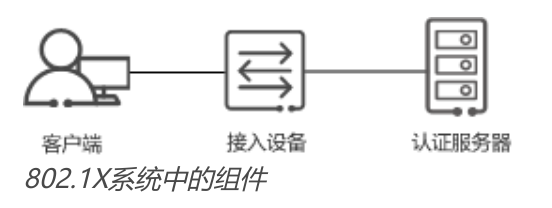
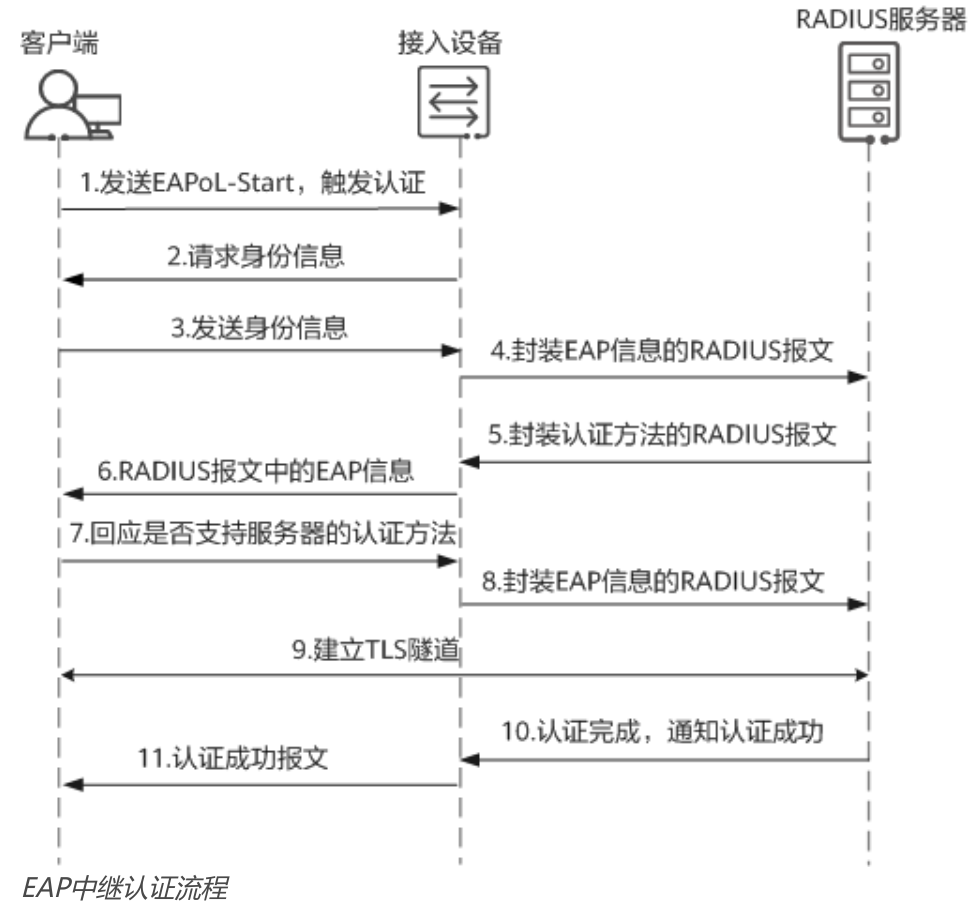

[原文地址：https://info.support.huawei.com/info-finder/encyclopedia/zh/802.1X.html](https://info.support.huawei.com/info-finder/encyclopedia/zh/802.1X.html)

# 802.1X

## 什么是802.1X

802.1X是一种基于端口的网络接入控制协议。基于802.1X协议的用户认证方式叫做802.1X认证。802.1X认证被广泛应用在信息安全要求严格的网络中。

## 802.1X协议的背景

早期的IEEE 802 LAN协议中，只要用户可以接入局域网的控制设备（例如接入交换机），就可以访问局域网中的设备或资源，这无疑是存在安全隐患的。为解决无线局域网的安全问题，IEEE 802委员会提出了802.1X协议。802.1X协议可以控制用户的网络访问权限，防止身份不明或未经授权的用户传输和接收数据。由于802.1X协议的普适性，因此后来也广泛应用于有线局域网。

与其他接入控制机制不同，802.1X协议是通过控制接入端口，实现用户级的接入控制。在802.1X协议中，物理接入端口被划分为“受控端口”和“非受控端口”这两个逻辑端口，用于实现业务与认证的分离。非受控端口主要用于传递EAPOL协议帧，始终处于双向连通状态，保证客户端始终能够发出或接收认证报文；而受控端口用于传递业务报文，因此在授权状态下处于双向连通状态，在非授权状态下不从客户端接收任何报文。

换言之，基于802.1X协议的认证，其最终目的就是确定用户的接入端口是否可用。如果认证成功，那么就打开端口，允许客户端的所有报文通过；如果认证不成功，就保持端口的关闭状态，只允许EAPOL协议帧通过。

## 什么时候需要使用802.1X

通常在新建网络、用户集中或者信息安全要求严格的场景中使用802.1X认证。802.1X认证具有以下优点：

* 对接入设备的性能要求不高。802.1X协议为二层协议，不需要到达三层，可以有效降低建网成本。
* 在未授权状态下，不允许与客户端交互业务报文，因此保证了业务安全。

以企业网络为例。员工终端一般需要接入办公网络，安全要求较高，此时推荐使用802.1X认证。

但802.1X认证要求客户端必须安装802.1X客户端软件。在机场、商业中心等公共场所，用户流动性大，终端类型复杂，且安全要求不高，可以使用Portal认证。对于打印机、传真机等哑终端，可以使用MAC认证，以应对哑终端不支持安装802.1X客户端软件，或者不支持输入用户名和密码的情况。

## 802.1X是如何工作的

如下图所示，802.1X认证系统为典型的Client/Server结构，包括三个组件：客户端、接入设备和认证服务器。

* 客户端通常是用户终端设备。客户端必须支持局域网上的可扩展认证协议（Extensible Authentication Protocol over LANs，EAPoL），并且安装802.1X客户端软件，从而使用户能够通过启动客户端软件发起802.1X认证。
* 接入设备通常是支持802.1X协议的网络设备，例如交换机。它为客户端提供接入局域网的端口，该端口可以是物理端口，也可以是逻辑端口。
* 认证服务器用于实现对用户进行认证、授权和计费，通常为RADIUS服务器。

在用户终端安装802.1X客户端软件后，用户可向接入设备发起认证申请。接入设备和用户终端交互信息后，把用户信息发送到认证服务器进行认证。若认证成功，则接入设备打开与该用户相连的接口，允许其访问网络；若认证失败，则接入设备将不允许其访问网络。

802.1X认证系统使用可扩展认证协议（Extensible Authentication Protocol，EAP）来实现客户端、设备端和认证服务器之间的信息交互。EAP协议可以运行在各种底层，包括数据链路层和上层协议（如UDP、TCP等），而不需要IP地址。因此使用EAP协议的802.1X认证具有良好的灵活性。

* 在客户端与接入设备之间，EAP协议报文使用EAPoL（EAP over LANs）封装格式，直接承载于LAN环境中。
* 在接入设备与认证服务器之间，可以采用EAP终结方式或者EAP中继方式交互认证信息。
  * EAP终结方式：接入设备直接解析EAP报文，把报文中的用户认证信息封装到RADIUS报文中，并将RADIUS报文发送给RADIUS服务器进行认证。EAP终结方式的优点是大多数RADIUS服务器都支持PAP和CHAP认证，无需升级服务器；但对接入设备的要求较高，接入设备要从EAP报文中提取客户端认证信息，通过标准的RADIUS协议对这些信息进行封装，且不能支持大多数EAP认证方法（MD5-Challenge除外）。
  * EAP中继方式：接入设备对接收到的EAP报文不作任何处理，直接将EAP报文封装到RADIUS报文中，并将RADIUS报文发送给RADIUS服务器进行认证。EAP中继方式也被称为EAPOR（EAP over Radius）。EAP中继方式的优点是设备端处理更简单，支持更多的认证方法；缺点则是认证服务器必须支持EAP，且处理能力要足够强。

以客户端发送EAPoL-Start报文触发认证为例，EAP中继方式的802.1X认证流程如下图所示。

1. 客户端发送EAPoL-Start报文触发802.1X认证。

2. 接入设备发送EAP请求报文，请求客户端的身份信息。

3. 客户端程序响应接入设备发出的请求，将身份信息通过EAP响应报文发送给接入设备。

4. 接入设备将EAP报文封装在RADIUS报文中，发送给认证服务器进行处理。

5. RADIUS服务器收到接入设备转发的身份信息后，启动和客户端EAP认证方法的协商。RADIUS服务器选择一个EAP认证方法，将认证方法封装在RADIUS报文中，发送给接入设备。

6. 接入设备收到RADIUS报文，将其中的EAP信息转发给客户端。

7. 客户端收到EAP信息，解析其中的EAP认证方法。如果支持该认证方法，客户端发送EAP响应报文给接入设备；否则，客户端在EAP响应报文中封装一个支持的EAP认证方法，并发送给接入设备。

8. 接入设备将报文中的EAP信息封装到RADIUS报文中，并发送RADIUS报文到RADIUS服务器。

9. RADIUS服务器收到后，如果客户端与服务器选择的认证方法一致，EAP认证方法协商成功，开始认证。以EAP-PEAP认证方法为例，服务器将自己的证书封装到RADIUS报文中，通过接入设备发送给客户端。客户端与RADIUS服务器协商TLS参数，建立TLS隧道。TLS隧道建立完成后，用户信息将通过TLS加密在客户端、接入设备和RADIUS服务器之间传输。

10. RADIUS服务器完成对客户端身份验证之后，通知接入设备认证成功。

11. 接入设备向客户端发送认证成功报文，并将端口改为授权状态，允许用户通过该端口访问网络。
