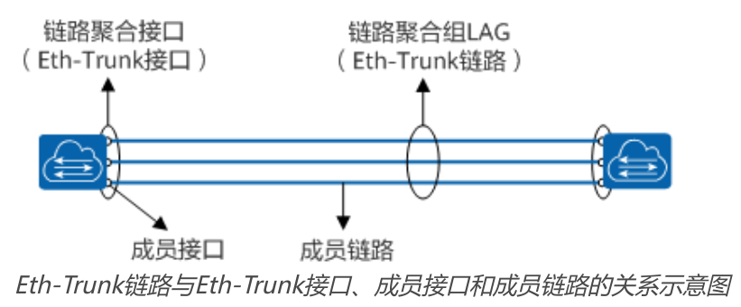
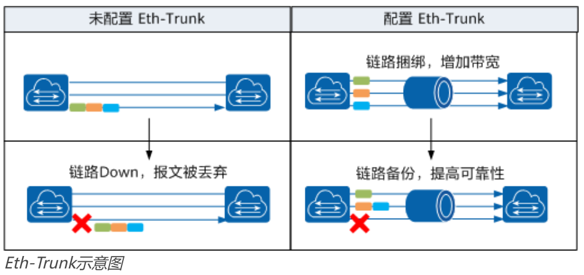
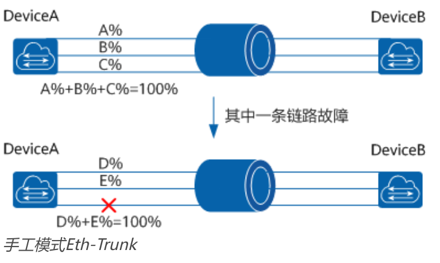
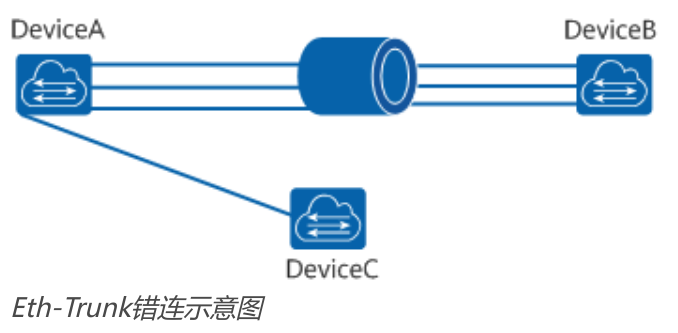
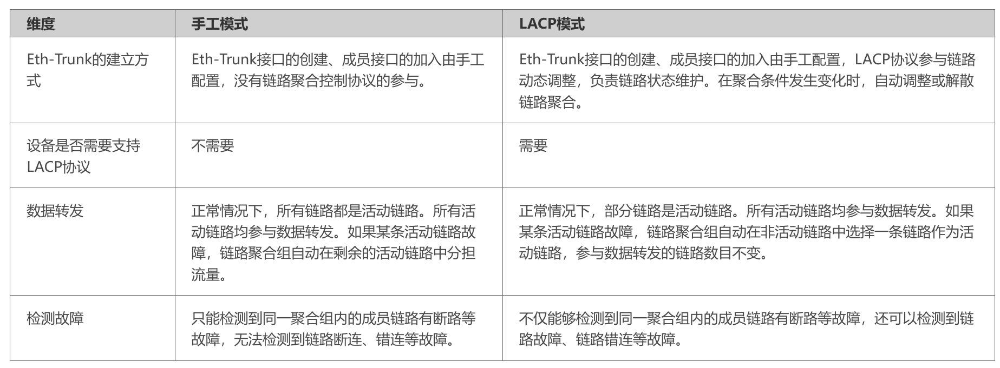
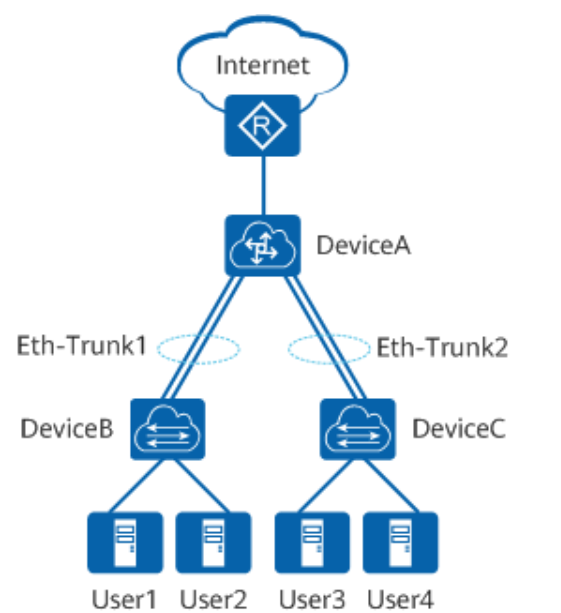

[原文地址：https://info.support.huawei.com/info-finder/encyclopedia/zh/Eth-trunk.html](https://info.support.huawei.com/info-finder/encyclopedia/zh/Eth-trunk.html)

# Eth-trunk

## 什么是Eth-trunk

Eth-trunk通过将多条以太网物理链路捆绑在一起成为一条逻辑链路，从而实现增加链路带宽的目的。捆绑在一起的链路通过相互间的动态备份，可以有效地提高链路的可靠性。

## 为什么需要Eth-trunk

随着网络规模不断扩大，用户对骨干链路的带宽和可靠性提出越来越高的要求。在传统技术中，常用更换高速率的单板或更换支持高速率单板的设备的方式来增加带宽，但这种方案需要付出高额的费用，而且不够灵活。

Eth-Trunk又叫以太网链路聚合Eth-Trunk，它通过将多条以太网物理链路捆绑在一起成为一条逻辑链路。达到增加链路带宽的目的。在实现增大带宽目的的同时，Eth-Trunk采用备份链路的机制，可以有效的提高设备之间链路的可靠性。每个聚合组唯一对应着一个逻辑接口，这个逻辑接口称之为链路聚合接口或Eth-Trunk接口。链路聚合接口可以作为普通的以太网接口来使用，与普通以太网接口的差别在于：转发的时候链路聚合组需要从成员接口中选择一个或多个接口来进行数据转发。

Eth-Trunk位于MAC与LLC子层之间，属于数据链路层。Eth-Trunk模块内部维护一张转发表，主要由以下两个组成：

* HASH-KEY值：根据数据包的MAC地址或IP地址等，经HASH算法计算得出。
* 接口号：Eth-Trunk转发表表项分布和设备每个Eth-Trunk支持加入的成员接口数量相关，不同的HASH-KEY值对应不同的出接口。

Eth-Trunk模块根据转发表转发数据帧的过程如下：
* Eth-Trunk模块从MAC子层接收到一个数据帧后，根据负载分担方式提取数据帧的源MAC地址/IP地址或目的MAC地址/IP地址。
* 根据HASH算法进行计算，得到HASH-KEY值。
* Eth-Trunk模块根据HASH-KEY值在转发表中查找对应的接口，把数据帧从该接口发送出去。

## Eth-trunk的优势

Eth-Trunk主要有以下优势：

* 增加带宽：链路聚合接口的最大带宽可以达到各成员接口带宽之和。
* 提高可靠性：当某条活动链路出现故障时，流量可以切换到其他可用的成员链路上，从而提高链路聚合接口的可靠性。
* 负载分担：在一个链路聚合组内，可以实现在各成员活动链路上的负载分担。
* 应用简单：Eth-trunk的作用域仅在相邻设备之间，和整个网络结构无关，应用更简单。

## Eth-trunk有哪些模式

根据是否启用链路聚合控制协议LACP（Link Aggregation Control Protocol），Eth-trunk的模式分为手工模式和LACP模式。

### 手工模式Eth-Trunk

手工模式Eth-Trunk，Eth-Trunk的建立、成员接口的加入由手工配置，没有链路聚合控制协议LACP的参与。如果某条活动链路故障，链路聚合组自动在剩余的活动链路中平均分担流量。当需要在两个直连设备之间提供一个较大的链路带宽，而其中一端或两端设备都不支持LACP协议时，可以配置手工模式Eth-Trunk。

DeviceA与DeviceB之间创建Eth-Trunk，手工模式下三条活动链路都参与数据转发并分担流量。当一条链路故障时，故障链路无法转发数据，链路聚合组自动在剩余的两条活动链路中分担流量。

### LACP模式Eth-Trunk

LACP是基于IEEE802.3ad标准的一种实现链路动态聚合与解聚合的协议，以供设备根据自身配置自动形成聚合链路并启动聚合链路收发数据，LACP模式就是采用LACP的一种链路聚合模式。聚合链路形成以后，LACP负责维护链路状态，在聚合条件发生变化时，自动调整链路聚合。

DeviceA与DeviceB之间创建Eth-Trunk，需要将DeviceA上的四个接口与DeviceB捆绑成一个Eth-Trunk。由于错将DeviceA上的一个接口与DeviceC相连，这将会导致DeviceA向DeviceB传输数据时可能会将本应该发到DeviceB的数据发送到DeviceC上。而手工模式的Eth-Trunk不能及时检测到此故障。

如果在DeviceA和DeviceB上都启用LACP协议，经过协商后，Eth-Trunk就会选择正确连接的链路作为活动链路来转发数据，从而DeviceA发送的数据能够正确到达DeviceB。

手工模式Eth-Trunk和LACP模式Eth-Trunk的区别如下所示。

## Eth-trunk的应用场景

数据中心的接入层交换机DeviceB和DeviceC接入到核心层交换机DeviceA，且DeviceB和DeviceC连接很多用户，DeviceA经出口路由器与数据中心外部网络互通。随着用户规模的不断扩大，用户之间的互访更为频繁，DeviceA和DeviceB、DeviceA和DeviceC之间的链路要有足够的带宽来承载不同用户的互访，并且链路要具备一定的可靠性。为保证DeviceA和DeviceB、DeviceA和DeviceC之间的链路带宽及可靠性，可以在它们之间分别建立Eth-Trunk1和Eth-Trunk2。

Eth-Trunk的工作模式根据以下两种情况选择：

* 如果两端设备均支持LACP协议，推荐使用LACP模式链路聚合。
* 如果对端设备不支持LACP协议，使用手工负载分担模式链路聚合。